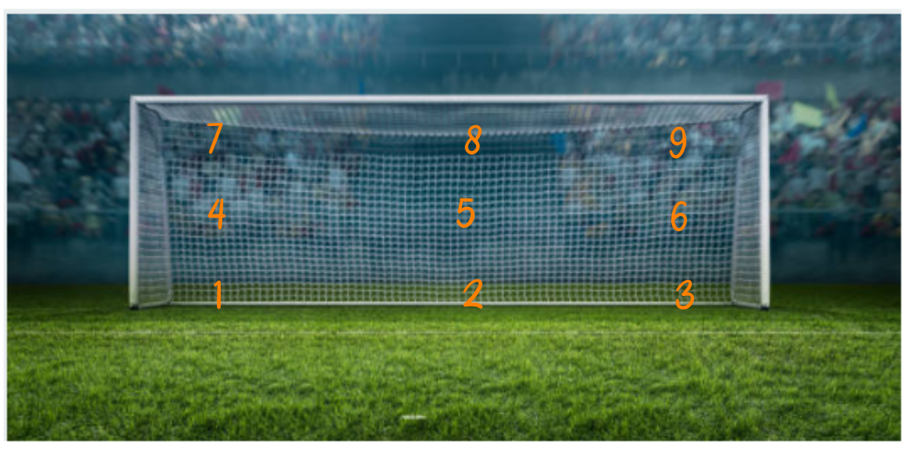

```{r setup, include=FALSE}
knitr::opts_chunk$set(echo = TRUE, message = FALSE, warning = FALSE, comment = NA)
```

<br/>

La probabilidad es un número entre cero y uno que se asigna a cada resultado de un evento aleatorio, mediante diferentes enfoques.  A continuación se definen los enfoque:

* Clásico o a priori
* Frecuentista
* Subjetiva

<br/><br/>

<div class="content-box-blue">

## <span style="color:#034a94">**Enfoque clásico**</span>  

Es el enfoque más antiguo de probabilidad y está basado en el supuesto de eventos individuales igualmente probables. La probabilidad bajo ese enfoque para el evento $A$ se calcula como la fracción entre el número de elementos del conjunto $A$, $n(A)$ y el número de elementos del espacio muestral $n(S)$: 

$$P(A)=\dfrac{n(A)}{n(S)}$$

</div>

En el caso del evento $A_{1}=\{(c,c)\}$, su probabilidad se obtiene como: 

$P(A_{1}=\dfrac{n(A_{1})}{n(S_{1})}=\dfrac{1}{4}=0.25$ 

Para $A_{2}$, la suma de los resultados es inferior a 6, se obtiene de la siguiente forma

$P(A_{2})=\dfrac{n(A_{2})}{n(S_{2})}=\dfrac{9}{36}=0.25$

<br/><br/> 


En la gran mayoría de casos no se cumplen los supuestos anteriores (eventos equiprobables o con igual probabilidad), pues se tienen eventos con diferentes probablilidades, lo cual impide que podamos utilizar el enfoque clásico. 

Ente este problemas debemos suponer que lo ocurrido en el pasado seguirá pasando y así mediante el  estudiando la información recogida podemos predecir la posibilidad de ocurrencia de un evento futuro.

<br/><br/><br/>

<div class="content-box-blue">

## <span style="color:#034a94">**Enfoque Frecuentista**</span>

Este enfoque se basa en la frecuencia con que ocurre un evento $A$ y el tamaño de muestra $n$, permitiendo calcular la probabilidad como una proporción de veces que ocurre un resultado sobre las veces en que se repite el experimento.  Cuanto mayor sea el tamaño de muestra mayor será su proximidad al valor de  probabilidad.


$$\lim_{n \to{+}\infty} P(A)=\Bigg[ \dfrac{\text{número de veces que ocurre A}}{n} \Bigg]$$

</div>

<br/><br/>

<center>
```{r, echo=FALSE, out.width="70%", fig.align = "center"}

```
**Figura 2.1** Zonas de un arco de futbol 
<br/>
<sub>
Tomada de iStock.com
</sub>
</center>

<br/>

Si observamos el cobro de un "penalti" en un partido de fútbol, el cobrador tiene un gran número de posibilidades (lugares) para colocar el balón que podemos simplificar en 9 como se muestra en la Figura 2.1 : (1) parte baja a su izquierda, (2) baja al centro, (3) baja a su derecha, (4) parte media a su izquierda, (5) media al medio, (6)  parte centro a la derecha  y finalmente (7) parte superior a su izquierda, (8) parte superior al centro y (9) parte superior a su derecha . Por su parte el arquero piensa también es estos lugrares para evitar que el disparo termine en gol. Ambos jugadores estudian las frecuencias para determinar cual lugar ofrece mayores probabilidades de obtener éxito desde su rol.

<br/>

Para calcular la probabilidad de que un jugador ejecute y convierta un gol de "penalti", debemos utilizar el enfoque frecuentista, contando para ello información pasada y realizando una división entre el número de aciertos sobre el número total de cobros a cargo del jugador.


<br/><br/><br/>

<div class="content-box-blue">

## <span style="color:#034a94">**Enfoque subjetivo**</span> 

En este caso la probabilidad es valorada y asignada por un **EXPERTO**, es decir que el valor de probabilidad es asignado a juicio de una persona de acuerdo con su experiencia  como:  un médico, un ingeniero, un abogado, un economista, un biólogo, un científico de datos ......

</div>

<br/><br/><br/>

## <span style="color:#034a94">**Axiomas de  probabilidad**</span>

<div class="content-box-blue">

+ $A_{1}$ : Sea $S$ un espacio muestral  asociado a un experimento. Entonces:

$$P(S)=1$$ 

<br/>

+ $A_{2}$ : Para cualquier evento $A$, se cumple que:

$$0 \leq P(A) \leq 1$$ 

<br/>

+ $A_{3}$ : Si $A$ y $B$ son dos eventos mutuamente excluyentes, entonces: 
$$P(A \cup B) = P(A) + P(B)$$ 
En general 

$$P(A \cup B) = P(A)+ P(B) - P(A \cap B)$$ 

<br/>

+ $A_{4}$ : Para cualquier evento $A$, $$P(A')=1-P(A)$$

<br/>

+ $A_{5}$ : La probabilidad que no ocurra nada : 

$$P(\phi) = 0$$   

</div>

<br/><br/><br/>
