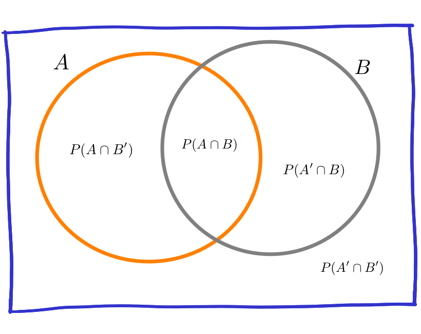

```{r setup, include=FALSE}
knitr::opts_chunk$set(echo = TRUE, message = FALSE, warning = FALSE, comment = NA)
```

## **Enfoques de probabilidad**

<br/><br/><br/>

<div style="padding: 15px; border: 1px solid transparent; border-color: transparent; margin-bottom: 20px; border-radius: 4px; color: #000000; background-color: #dbd4e8 ; border-color: #000000;">

### **Enfoque clásico**  

Es el enfoque más antiguo de probabilidad y que está basado en el supuesto de eventos individuales igualmente probables. La probabilidad bajo ese enfoque para el evento $A$ se calcula como la fracción entre el número de elementos del conjunto $A$, $n(A)$ y el número de elementos del espacio muestral $n(S)$: 
		
$$P(A)=\dfrac{n(A)}{n(S)}$$

</div>
	
En el caso del evento $A_{1}=\{(c,c)\}$, su probabilidad se obtiene como: 

$P(A_{1}=\dfrac{n(A_{1})}{n(S_{1})}=\dfrac{1}{4}=0.25$ 

Para $A_{2}$, la suma de los resultados es inferior a 6, se obtiene de la siguiente forma

$P(A_{2})=\dfrac{n(A_{2})}{n(S_{2})}=\dfrac{9}{36}=0.25$

<br/><br/> 


En la gran mayoria de casos no se cumplen los supuestos anteriores, pues se tienen eventos que no son igualmente probables, lo cual impide que podamos utilizar el enfoque frecuentista. 

Ahora suponemos que lo ocurrió en el pasado segirá pasando y asi estudiando la información recogida podemos predecir la posibilidad de ocurrencia de un evento futuro

<br/><br/><br/>

<div style="padding: 15px; border: 1px solid transparent; border-color: transparent; margin-bottom: 20px; border-radius: 4px; color: #000000; background-color: #dbd4e8 ; border-color: #000000;">

### **Enfoque Frecuentista**

Este enfoque basa su cálculo en la frecuencia con que ocurre un evento en un tamaño de muestra determinado $n$.

			
$$\lim_{n \to{+}\infty} P(A)=\Bigg[ \dfrac{\text{número de veces que ocurre A}}{n} \Bigg]$$

</div>

<br/><br/>

<center>

</center>

<br/><br/>

Si observamos el cobro de un penalti en un partido de fútbol, el cobrador tiene un gran número de posibilidades (lugares) para colocar el balón que podemos simplificar en 6 : parte baja derecha, parte alta derecha, parte baja al centro, parte alta central, parte baja izquierda y parte alta izquierda. Por su parte el arquero piensa también es estos lograres para evitar que el disparo termine en gol. Hoy en dia ambos jugadores estudian las frecuencias para determinar cual lugar ofrece mayores probabilidades de obtener éxito desde su rol.

<br/>

Para calcular la probabilidad de que un jugador ejecute y convierta gol, debemos utilizar el enfoque frecuentista, contando para ello información pasada y realizando una división entre el numero de aciertos sobre el numero total de cobros.

<br/>

Otro ejemplo puede estar relacionado con la probabilidad de muerte por Covid en Colombia. Es de aclarar que esta probabilidad no se mantiene constante a través del tiempo pues los efectos causados por la vacunación y su evolución hacen que esta probabilidad cambie. Por fines prácticos tomaremos la base total de colombianos infectados desde marzo del 2019 como denominador y como numerador el numero total de muertos

```{r, eval=FALSE}
Colombia=readRDS("data/Colombia22.RDS")
tabla=summarytools::freq(Colombia22$ubicacion, cumul = FALSE)
tabla
```

Con base en esta tabla podríamos pensar que la probabilidad de que una persona muera a causa del Covid-19 es del `0.0289`. Valor que se obtiene al dividir el número de personas fallecidas y el número total de personas que se han contraído covid. Claro bajo el supuesto de que todos las personas tenemos la misma probabilidad de fallecer. Hecho que se discutirá mas adelante.

<br/><br/><br/>

<div style="padding: 15px; border: 1px solid transparent; border-color: transparent; margin-bottom: 20px; border-radius: 4px; color: #000000; background-color: #dbd4e8 ; border-color: #000000;">

### **Enfoque subjetivo** 

En este caso la probabilidad es valorada y asignada por un **EXPERTO**, como un médico, un ingeniero, un abogado, un economista, un biólogo, un estadístico ......

</div>

<br/><br/><br/>

## **Axiomas de  probabilidad**

<div style="padding: 15px; border: 1px solid transparent; border-color: transparent; margin-bottom: 20px; border-radius: 4px; color: #000000; background-color: #dbd4e8 ; border-color: #000000;">

+ $A_{1}$ : Sea $S$ un espacio muestral  asociado a un experimento. Entonces:

$$P(S)=1$$ 

+ $A_{2}$ : Para cualquier evento $A$, se cumple que:

$$0 \leq P(A) \leq 1$$ 

+ $A_{3}$ : Si $A$ y $B$ son dos eventos mutuamente excluyentes, entonces: 
$$P(A \cup B) = P(A) + P(B)$$ 
En general 

$$P(A \cup B) = P(A)+ P(B) - P(A \cap B)$$ 


+ $A_{4}$ : Para cualquier evento $A$, $P(A')=1-P(A)$

+ $A_{5}$ : La probabilidad que no ocurra nada : 

$$P(\phi) = 0$$   

</div>

<br/><br/><br/>

## **Tipos de probabilidad**

<br/><br/>

:::: {style="display: flex;"}
::: {}

```{r, echo=FALSE, out.width="70%", fig.align = "center"}
knitr::include_graphics("img/tabla1_22.png")
```
  
:::
::: {}

```{r, echo=FALSE, out.width="70%", fig.align = "center"}

```
:::
  
::::


<br/><br/>

### **Probabilidad simple o marginal**
			
+ $P(A)$ : probabilidad de que ocurra A 

+ $P(A')$ : probabilidad de que NO ocurra A 

+ $P(B)$ : probabilidad de que ocurra B 

+ $P(B')$ : probabilidad de que NO ocurra B 
			
<br/><br/><br/>

### **Probabilidad conjunta** 
			
+ $P(A \cap B)$ : probabilidad de que ocurra A y B 
			
+ $P(A' \cap B)$ : probabilidad de que NO ocurra A y ocurra B 

+ $P(A \cap B')$ : probabilidad de que ocurra A y NO ocurra B 

+ $P(A' \cap B')$ : probabilidad de que NO ocurra A ni B 

<br/><br/>


