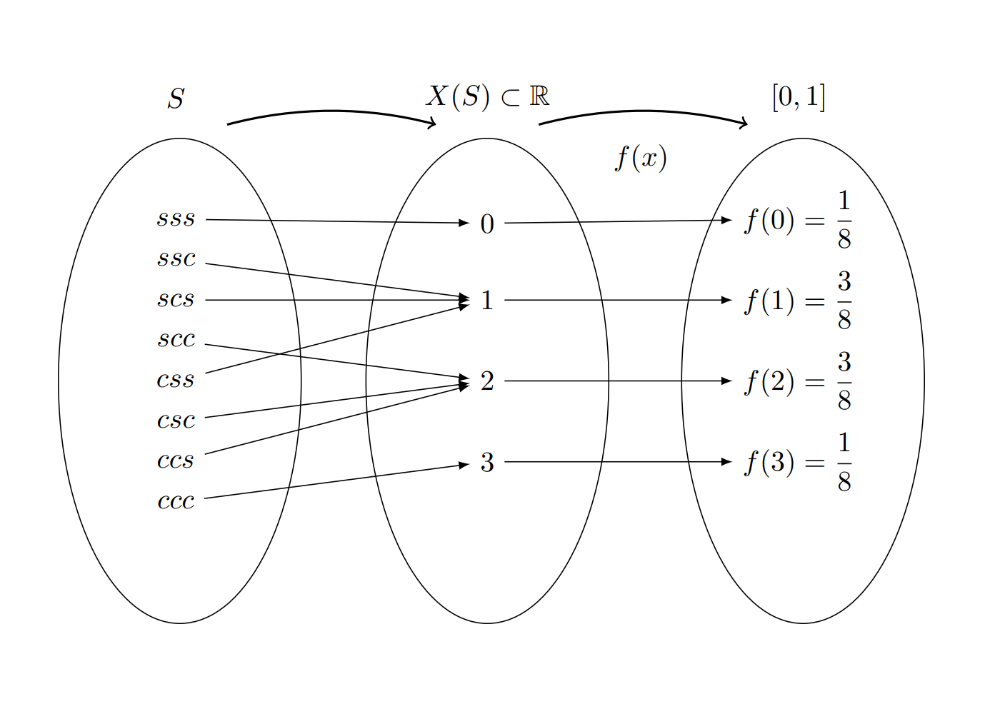

```{r setup, include=FALSE}
knitr::opts_chunk$set(echo = TRUE, message = FALSE, warning = FALSE, comment = NA)
```


<br/><br/>

# <span style="color:#034a94">**Introducción**</span>

El concepto de variable aleatoria constituye uno de los principales pilares de la probabilidad y estadística. A este concepto se pueden asociar dos paradigmas de evolución histórica según J.A. Alberth & B. Ruiz (2013) , El primero basada en el resultado de fenómenos aleatorios y por otro lado el proceso que relaciona los conjuntos de espacio muestral y sus respectivas probabilidades, para definir el concepto de variable aleatoria como función de números reales y  el espacio para el sustento matemático. 

Este  concepto está relacionado a diferentes contextos donde se requiere dar respuesta a preguntas relacionadas con la ocurrencia o no de fenómenos aleatorios que eventualmente se presentarán en el futuro, como por ejemplo: 

* ¿Cuánto tiempo se tarda un estudiante  en ir de su casa a la universidad?

* ¿Cuál será  el resultado en mi próximo examen de estadística? 

* El dueño de la cafetería se puede preguntar ¿Cuantas botellas de agua se venderán esta semana?

* ¿Cuánto  tiempo tardaría  la entrega de un  paquete una empresa  de mensajería?

* ¿Cuánto tiempo dura la  bombilla de un  vehículo? 

* ¿Qué  diámetro tendrá la  perforación de una máquina en una lámina de acero que hace parte de una puerta de un vehículo?

* ¿Cuantos mensajes recibiré hoy por WhatsApp?


En  todos los casos se trata de  preguntas que tienen  diferentes  respuestas, o  que no tienen un único valor como  respuesta.  En este documento  se estudiará el concepto de variable aleatoria y mediante la definición  de una función  matemática que nos  permita caracterizar su  comportamiento, realizaremos diferentes cálculos de probabilidades de interés. Para ello será necesario  retomar conocimientos de cálculo integral que serán  expuestos en su momento mediante funciones de fácil manejo.

En esta unidad se tratará el  caso univariado discreto, luego el caso continuo,con sus principales características, conceptos relacionados con los vistos en el modulo anterior.

<br/><br/>

<div class="content-box-blue">

### <span style="color:#034a94">**Definición Variable aleatoria**</span>

Una variable aleatoria $X$ es una función que asigna a cada valor de un espacio muestral $S$ un número . El conjunto formado por estos números conforman un subconjunto de los  reales llamado rango de la variable $X$, ($R_{_{X}}$) 

</div> 

<br/><br/>

Las variables aleatorias se clasifican teniendo en cuenta las características de su rango en **discretas**, **continuas**. La distribución de una variable aleatoria será *univariada** si se estudia el comportamiento de una sola variable y serán **multivariadas** si se considera el comportamiento conjunto de varias variables definidas sobre el mismo espacio muestral.

<br/><br/>


<div class="content-box-blue">

### <span style="color:#034a94">**Tipos de variables**</span>

+ Una variable $X$ se considera **DISCRETA** si su rango $R_{_{X}}$ es un conjunto finito o infinito numerable de valores.

+ Se considera **CONTINUA** si su rango $R_{_{X}}$ es un conjunto de valores infinito no numerable y generalmente corresponde a unión de intervalos.

</div> 

<br/><br/>

### <span style="color:#FF7F00"> **Ejemplo**</span>

Un experimento aleatorio $E$, consiste en lanzar una moneda balanceada al aire tres veces y observar el orden de caras ($c$) y sellos ($s$) que se obtienen en los tres lanzamientos. El espacio muestral $S$ de $E$, estará dado por: |

$$S =\{(s,s,s),(s,s,c),(s,c,s),(s,c,c),(c,s,s),(c,s,c),(c,c,s),(c,c,c)\} $$


<center>

{width=60%}<br/>
**Figura 2.13** Relación espacio muestral, rango, variable aleatoria
</center>
<br/>

Donde :

+ $X$ es la variable que asigna a cada resultado el número de caras en los tres lanzamientos de la moneda. 

+ $R_{_{X}}=\{0,1,2,3\}$ determinado por la regla de asignación: número de caras en los tres lanzamientos de la moneda y corresponde al rango de valores que puede tomar la variable aleatoria.
+ $f_{_{X}}(x)=P(X=x)$ conforma la función  que asigna a cada valor de la variable una probabilidad 

<br/><br/>

En este ejemplo :

+ $(X=0)=\{(s,s,s)\}$ ; 
+ $(X=1)=\{(s,s,c),(s,c,s),(c,s,s)\}$ ;  
+ $(X=2)=\{(s,c,c),(c,s,c),(c,c,s) \}$ y 
+ $(X=3) =\{(c,c,c) \}$. 

Bajo el supuesto que la moneda es balanceada, se cumple que los resultados en $S$ son igualmente posibles y por lo tanto: 

$$f_{_{X}}(0) =P(X=0)= \frac{1}{8} \hspace{.2cm} ,\hspace{.5cm} f_{_{X}}(1) = P(X=1)=\frac{3}{8},$$
$$f_{_{X}}(2) = P(X=2)=\frac{3}{8}\hspace{.2cm} ,\hspace{.5cm} f_{_{X}}(3) =P(X=3)= \frac{1}{8}$$

<br/><br/>


# <span style="color:#034a94">**Variables discretas**</span> 

Como se mencionó anteriormente una variable aleatoria se considera como **DISCRETA** cuando el conjunto de posibles valores que puede tomar la variables es un conjunto finito o infinito numerable. En la gran mayoria de los casos este conjunto corresponde a los números enteros.

Para catacterizar la variable se define  la función de distribución de probabilidad que modela la asignación de las probabilidades


<br/><br/>

<div class="content-box-blue">

### <span style="color:#034a94">**Función de distribución de probabilidad**</span>

Para $X$ un variable aleatoria discreta, su función de distribución de probabilidad estará dada por $f(x)$, la cual proporciona las probabilidades asociadas a todos los valores de su rango $R_{X}$ . Esta función debe cumplir las siguientes propiedades:

+ $f(x) = P(X=x) \geq 0$

+ $\sum_{R_X} f(x) = 1$

</div>

<br/><br/>

Por lo general este tipo de variables proceden del conteo y empiezan por **número de....**  

<br/>


### <span style="color:#FF7F00"> **Ejemplo**</span>

Las siguientes variables se clasifican como **variables aleatorias discretas** :

* $X$ : Número de llamadas que entran a un conmutador diariamente

* $Y$: Número de personas contagiadas por Covid 19 durante un día

* $Z$: Número de quejas reportadas a una sucursal bancaria en un día

* $W$: Número de accidentes producidos en una ciudad

* $S$: Número de huevos producidos diariamente en una avícola

* $T$: Número de hijos en una familia

* $M$: Número de mensajes enviados en un grupo de Whatsapp

<br/><br/>

Como complemento de $f(x)$ y debido a que puede resultar más interesante calcular probabilidades de rangos de valores se define la función de distribución acumulada $F(x)$

<br/><br/>

<div class="content-box-blue">

### <span style="color:#034a94">**Función de probabilidad acumulada**</span>

Sea $X$ una variable aleatoria continua con función de densidad $f_{X}(x)$, se define la  función de distribución acumulada, $F_{X}(x)$, como:

$$F(x)=P(X\leq x)=\sum _{t \leq x}f(t)$$

</div> 

<br/><br/>

### <span style="color:#FF7F00"> **Ejemplo**</span>

El restaurante "Asados y algo más"  solo da servicio mediante reservas. De acuerdo con los registros diarios en los últimos diez años se sabe que el treinta por ciento de las personas que reservan no llegan al restaurante. El restaurante tiene veinte  puestos y acepta cuarenta reservas. La función de distribución probabilidad que modela el número de personas que llegan al restaurante es $f$, dada por: 

<br/>

$$f_{_{X}}(x) = \left \{ 
\begin{matrix} 
	\displaystyle\binom{20}{x}(0.7)^{x}(0.3)^{20-x} & \mbox{si }	x=0,1,2,\ldots,20\\ 
	& \\
	0  & \mbox{en otro caso }
\end{matrix}\right.$$


<center>

```{r, echo=FALSE, fig.height=3.5}
library(ggplot2)
# modelo binomial  ok
dat<-data.frame(x<-0:20,
                fx<-dbinom(x,20,0.70))

ggplot(dat) + geom_point(aes(x, fx),colour = "#FF7F00", size = 2) +
scale_x_continuous(limits = c(0, 20),
                   breaks = 0:20, 
                   labels = c('0','1','2','3','4','5','6','7','8','9','10','11','12','13','14','15','16','17','18','19','20'))+
   labs(title = "",
       x= "x",
       y= "f(x)")
```

**Figura 2.14** Distribución binomial $n=20$, $p=0.70$
</center>

<br/>

<center>
```{r, echo=FALSE, fig.height=3.5}
library(ggplot2)
ggplot() +
  stat_function(fun = function(q) pbinom(q = q, size = 20, prob = 0.7),
                geom = "step",
                n = 20,
                colour = "#4271AE",
                size = 1) +
  scale_x_continuous(n.breaks = 20, limits = c(0, 20))+
   labs(title = "",
       x= "x",
       y= "F(x)")
```
<br/>
**Figura 2.14** Distribución acumulada binomial $n=20$, $p=0.70$
</center>

<br/>

$P(X = 0)  =  0$ 

$P(X = 15) =  0.178863$ 

$P(X < 15) = P(X \leq 14) =  0.5836$ 

$P(X > 15) = 1 - P(X \leq 14) = 0.4164$


<br/><br/><br/><br/>

# <span style="color:#034a94">**Variables continuas**</span>

Como se mencionó se considera una variable como continua cuando el conjunto de valores que puede tomar es un conjunto infinito no numerable, es decir que siempre podrá haber un valor entre dos valores de ella.

Para este caso la probabilidad se puede modelar a través de una función continua, la cual se puede visualizar al construir un gráfico de densidad a partir de una muestra de ellos. A esta función se le llama función de densidad de probabilidad


### <span style="color:#FF7F00"> **Ejemplo**</span>

En el caso de las **variables aleatorias continuas** por lo general proceden de una **medición** como por ejemplo:

+ T: Tiempo que tarda un estudiante en responder un examen

+ P: Peso de un bebe recien nacido

+ E: Edad de una persona

+ V: Tiempo que tarda un vehículo en requerir una reparación de su motor

+ D: Diámetro de un agujero realizado en una lamina de acero

+ X: Cantidad de azúcar contenida en un refresco

+ C: Proporción de cemento en concreto


<br/><br/>

<div class="content-box-blue">


### <span style="color:#034a94">**Función de densidad de probabilidad**</span> 

La función de densidad de probablidad se define como $f(x)$, tal que cumpla las siguientes condiciones:

+ $f(x) \geq 0$

+ $\displaystyle\int\limits_{-\infty}^{+\infty}f(x)\:dx =1$

+ $P(a < X < b)=\displaystyle\int\limits_{a}^{b}f(x)\:dx$

</div> 


<br/><br/>

Para el caso continuo la función de distribución de probabilidad corresponde a una integral 

<br/>

<div class="content-box-blue">

### <span style="color:#034a94">**Función de probabilidad acumulada**</span>

$F_{_X}(x)=P(X \leq x)=\displaystyle\int \limits_{-\infty}^{x}f_{_X}(t)\:dt$

$F(x) = P(X \leq x) = P(X < x)$
</div> 

<br/><br/>


### <span style="color:#FF7F00"> **Ejemplo**</span>

Con base en información histórica una compañía que fabrica lavadoras determinó que el tiempo $Y$ (en años) para que el electrodoméstico requiera una reparación mayor se obtiene mediante la siguiente función de densidad de probabilidad: 

<br/>

$$f_{_{X}}(x) = \left \{ 
\begin{matrix} 
	\dfrac{1}{4} e^{-x/4} & \mbox{ , }	x \geq 0\\ 
	& \\
	0  & \mbox{en otro caso }
\end{matrix}\right.$$


<br/>

<center>
```{r, echo=FALSE, fig.height=3.5}
fx=function(x){1/4*exp(-x/4)}
ggplot() +
  xlim(c(0, 20)) +
  geom_function(fun = fx,
                colour = "#FF7F00",
                lwd = 1,
                linetype = 1)
```
<br/>
**Figura 2.14** Distribución exponencial $\lambda = 1/4$
</center>

<br/>

</center>

Para tener la seguridad que $f(x)$ puede ser una función de densidad de probabilidad se debe verificar

<br/>

<pre>
fy=function(y){1/4*exp(-y/4)}
integrate(fy, lower=0,upper=Inf)

1 with absolute error < 2.7e-05
</pre>

$$\displaystyle\int\limits_{0}^{+\infty} \dfrac{1}{4} e^{-x/4} \:dx =1$$


