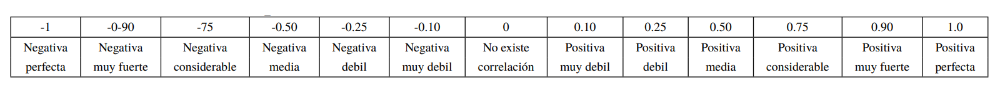
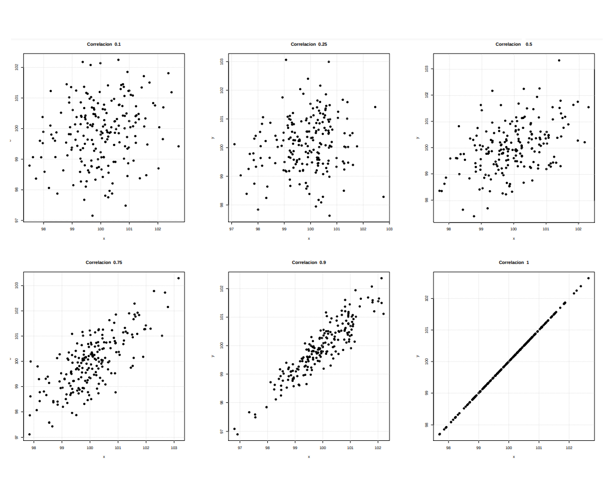

```{r setup, include=FALSE}
knitr::opts_chunk$set(echo = TRUE, message = FALSE, warning = FALSE, comment = NA)

```

Cuando se estudian dos variables al tiempo se conforma una variable aleatoria bivariada $(X,Y)$ que se define en un rango formado en un plano y cuyo valor de probabilidad genera un volumen como se muestra en la siguiente figura: 

```{r, echo=FALSE}
# tomada de:
# http://pj.freefaculty.org/R/WorkingExamples/plot-3d-MVNormal-1.R
library("mvtnorm")

N=30
x <- seq(-3,3, length=N)
y <- seq(-3,3,length=N)
z <- matrix(0, N, N)
for (i in 1:N) for (j in 1:N) {
	z[i,j]=dmvnorm(c(x[i],y[j]), c(0,0),
	matrix(c(1,0.5,0.5,1),2,2))}
persp(x,y,z,theta=20, phi=15, 
xlab="x", 
ylab="y", 
zlab="f(x,y)",
scale=TRUE,
expand=.4,
axes=TRUE,
col="#034A94")
```

<br/><br/>

## **Introducción**

Los resultados de un experimento pueden ser causa de múltiples variables como ocurre con el precio de un producto y sus ventas, el tiempo de preparación de un examen y su nota final, la cantidad de arena y de cemento en concreto, la cantidad de abono suministrado a una planta y su producción final. En estos casos se requiere una función de densidad que describa la variación de la probabilidad  de ocurrencia de ambas variables, probabilidad que describe el comportamiento conjunto de las variables. 

La función que tiene en cuenta efectos múltiples de variables aleatorias se denomina distribución de probabilidad conjunta. esta función puede ser una combinación de variables continua-continua, discreta-discreta o continua-discreta, dependiendo del experimento, en el caso bivariado.

En esta guía se presentan los casos : discreta-discreta y el caso continua-continua.

<br/><br/>

## **Discreto-Discreto**


### **Función de distribución de probabilidad conjunta**
Si se dispone de dos variables aleatorias se puede definir distribuciones bidimensionales de forma semejante al caso unidimensional. Para el caso discreto-discreto se define:

<div style="padding: 15px; border: 1px solid transparent; border-color: transparent; margin-bottom: 20px; border-radius: 4px; color: #000000; background-color: #FFFFFF ; border-color: #000000;">

**Función de distribución de probabilidad conjunta**
$$f_{_{X,Y}}(x,y)=P(X=x,Y=y)$$

la cual debe cumplir con las siguientes características:

+ $\displaystyle\sum\limits_{x=x_{(1)}}^{x_{(n)}}\displaystyle\sum\limits_{y=y_{(1)}}^{y_{(n)}}f_{_{X,Y}}(x,y)=1$

+ $f(x,y)\geq 0$ 

</div>

 <span style="color:#FF7F00"> **Ejemplo**</span>

El número de veces que falla una máquina $X$ con $R_{X}=\{1,2,3\}$ durante un día y el número de veces en que el operario requiere llamar al técnico para su arreglo esta dado por $Y$ con $R_{Y}=\{1,2,3\}$. Su función de probabilidad conjunta para $X,Y$ está dada por : 

|    |        |       |  $x$ |      |
|:--:|:------:|:-----:|:----:|:----:|
|    |$f(x,y)$| 1     |  2   |  3   |
|$y$ |  1     | 0.05  | 0.05 | 0.10 |
|    |  2     | 0.05 | 0.10 | 0.35  |
|    |  3     | 0     | 0.20 | 0.10 |


Para verificar que $f(xy)$ conforme una función de distribución de probabilidad conjunta verificamos que la suma de todas las probabilidades de 1

```{r}
fxy=matrix(c(0.05,0.05,0,0.05,0.10,0.20,0.10,0.35,0.10), ncol=3 )
fxy
sum(fxy)
```

El gráfico de la función de distribución conjunta se puede realizar de la siguiente forma:


```{r, echo=FALSE}
x=c(0,0,0,1,1,1,2,2,2)
y=c(0,1,2,0,1,2,0,1,2)
fxy=c(0.05,0.05,0, 0.05,0.10,0.20, 0.10,0.35,0.10)

plot3D::scatter3D(x, y, fxy,
colvar = NULL, 
col = "blue",
pch = 19, cex = 1.5,
phi = 20, theta = 60,  
zlab="f(xy)", xlab="x", ylab="y",
bty = "b2",
col.panel ="steelblue",
col.grid = "darkblue",
add_lines=TRUE)
```


<br/><br/>

### **Probabilidad marginales ** 

A partir de la función de distribución conjunta se pueden obtener las distribuciones marginales correspondientes a las variables $X$ y $Y$, denotadas por $g(x)$ y $h(y)$ respectivamente.

<div style="padding: 15px; border: 1px solid transparent; border-color: transparent; margin-bottom: 20px; border-radius: 4px; color: #000000; background-color: #FFFFF ; border-color: #000000;">

Si $X$, $Y$ son dos variables aleatorias discretas, entonces se puede definir la función de probabilidad marginal de $X$ (función de probabilidad de $X$ al margen de $Y$) como

$$g(x)=f_{_{X}}(x)=\sum_{y=y_{(1)}}^{y_{(n)}}f_{_{X,Y}}(x,y)$$

La función de probabilidad marginal de $Y$ (función de probabilidad de $Y$ al margen de $X$) como
$$h(y)=f_{_{Y}}(y)=\sum_{x=x_{(1)}}^{x_{(n)}}f_{_{X,Y}}(x,y)$$

</div> 

Para el ejemplo podemos establecer las funciones marginales para las variables $X$ y $Y$ sumando por columnas en el caso de $Y$ y por filas en el caso de la variable $X$

```{r}
fxy=matrix(c(0.05,0.05,0,0.05,0.10,0.20,0.10,0.35,0.10), ncol=3 )
gx=addmargins(fxy,1)
rownames(gx)=c("1","2","3","g(x)")
gx
```


Ahora para el caso de $h(y)$

```{r}
fxy=matrix(c(0.05,0.05,0,0.05,0.10,0.20,0.10,0.35,0.10), ncol=3 )
hy=addmargins(fxy,2)
colnames(hy)=c("1","2","3","h(y)")
hy
```


<br/><br/>


### **Probabilidad acumulada**


$$F_{_{X,Y}}(x,y)=\sum_{-\infty}^{x} \sum_{-\infty}^{y} f(x,y)$$

Para el ejemplo se construye la función de distribución acumulada sumando tanto por columna como fila hasta la posición de los valores observados, por ejemplo .

$$F(2,2)= F_{_{X,Y}}(x,y)=\sum_{x=1}^{2} \sum_{y=1}^{2} f(x,y)  = f(1,1) + f(1,2) + f(2,1) + f(2,2) = 0.05 + 0.05 + 0.05 + 0.10 = 0.25$$

```{r}
fxy=matrix(c(0.05,0.05,0,0.05,0.10,0.20,0.10,0.35,0.10), ncol=3 )
fxy=addmargins(fxy,c(1,2))
colnames(fxy)=c("1","2","3","h(y)")
rownames(fxy)=c("1","2","3","g(x)")
fxy
```


```{r}
Fxy=matrix(c(0.05,0.10,0.10,0.10,0.25,0.45,0.20,0.70,1.00), ncol=3 )
colnames(Fxy)=c("1","2","3")
rownames(Fxy)=c("1","2","3")
Fxy
```


<br/><br/><br/>

### **Probabilidad condicional**

En el caso de la probabilidad condicional se opera de la misma forma que se vió en el Módulo 2, en el cual se definió  como :

$$P(B|A)=\dfrac{P(A \cap B)}{P(A)}$$

Para el caso de las funciones de distribución de probabilida se opera de la misma manera :


<div style="padding: 15px; border: 1px solid transparent; border-color: transparent; margin-bottom: 20px; border-radius: 4px; color: #000000; background-color: #FFFFFF ; border-color: #000000;">

### **Función de densidad condicional** 
<br/><br/>

La función de densidad condicional de $X$ dado que $Y=y_0$ está dada por:
$$\begin{equation*}
	f_{_{X|Y}}(x|y_{0})=\left\lbrace
	\begin{array}{ccl}
		\dfrac{f_{_{X,Y}}(x,y_0)}{h(y_0)}&;& h(y_0) > 0\\
		&&\\
		0 &;&\mbox{en otro caso}
	\end{array}
	\right.
\end{equation*}$$
<br/><br/>
La función de densidad condicional de $Y$ dado que $X=x_0$ está dada por:
$$\begin{equation*}
	f_{Y|X}(y|x_{0})=\left\lbrace
	\begin{array}{ccl}
		\dfrac{f_{_{X,Y}}(x_0,y)}{g(x_0)}\:&;&\:g(x_0)>0\\
		&&\\
		0\:&;&\:\mbox{en otro caso}
	\end{array}
	\right.
\end{equation*}$$

</div> 


Para ilustrarlo utilizamos la función del Ejemplo 1 para la función condicional $f(x|y=2)$


|    |        |       |  $x$ |      | $h(y)$ |
|:---|:-------|:------|:-----|:-----|:-------|
|    |$f(x,y)$| 1     |  2   |  3   |        |
|$y$ |  2     | 0.050 | 0.10 | 0.35 |  0.50  |


|        |          |                     |  $x$                |                     |
|:------:|:---------|:--------------------|:--------------------|:--------------------|
|        |$f(x|y=2)$| 1                   |                 2   |                 3   |
|$x|y=2$ |          | $\dfrac{0.05}{0.50}=0.10$| $\dfrac{0.10}{0.50}=0.20$| $\dfrac{0.35}{0.50}=0.70$| 


<br/><br/><br/>


## **Caso Continuo-Continuo**


En el caso de variables continuas se utilizan los mismo conceptos vistos en el caso discreto-discreto, haciendo el cambio de las sumatorias por integrales definidas. 

### **Función de densidad conjunta**

En particular para $f_{_{X,Y}}(x,y)$ definida en una región $R$, se cumple que la integral doble de $f_{_{X,Y}}(x,y)$ en la región $R$ proporciona la probabilidad de que las variables $X$ y $Y$ asuman los valores $(x,y)$ en la región $R$. Esta integral puede interpretarse como el volumen bajo la superficie $f_{_{X,Y}}(x,y)$ en la región $R$.


<div style="padding: 15px; border: 1px solid transparent; border-color: transparent; margin-bottom: 20px; border-radius: 4px; color: #000000; background-color: #FFFFFF ; border-color: #000000;">

**Función de densidad conjunta**

Lafunción de densidad conjunta para las variables $X$ y $Y$ $f(x,y)$ debe cumplir las siguientes condiciones.


* $f(x,y) \geq 0$, para todo valor de $(x,y)$

* $\int_{-\infty}^{\infty} \int_{-\infty}^{\infty} f(x,y) \:dx \:dy  = 1$

</div> 

<br/><br/>

 <span style="color:#FF7F00"> **Ejemplo**</span>

La cantidad de ácido ($X$) y la cantidad de ácido ($Y$), en litros, que se vierten en una mezcla se modela con la función $f_{XY}$ como se presenta a continuación $f(x,y)$ esta dada por: 

$$f(x,y) = \left \{ \begin{matrix} (x+y) & \mbox{ } 0 \leq x \leq 1\\ 
	& \mbox{ } 0 \leq y \leq 1 \\
	&\\
	0 & \mbox{ en otro caso }\end{matrix}\right.  $$

<br/>


Inicialmente debemos de verificar que se trata de una función de densidad 


$\displaystyle\int_{0}^{1} \displaystyle\int_{0}^{1} (x+y) \:dx \:dy  = \displaystyle\int_{0}^{1}  \Bigg( \dfrac{x^{2}}{2}+ yx \Bigg|_{0}^{1}  \Bigg) \:dy$

<br/>

$\displaystyle\int_{0}^{1}  \Bigg( \dfrac{{1}}{2}+ y \Bigg) \:dy =\Bigg(\dfrac{1}{2}y + \dfrac{y^{2}}{2} \Bigg|_{0}^{1} \Bigg) = \dfrac{1}{2}\times  \dfrac{1}{2} = 1$


<br/><br/>

```{r}
library(cubature)
fxy<- function(x){(x[1]+ x[2])}
Ifxy=adaptIntegrate(fxy,lowerLimit=c(0,0),upperLimit=c(1,1))
Ifxy$integral
```

<br/><br/>

Su representación gráfica 

<br/><br/>

```{r, echo=FALSE, out.width="50%", fig.align = "center"}

```

<br/><br/>

### **Densidad marginales**

En el caso continuo- continuo las distribuciones de densidad marginales se pueden encontrar a partir de la función de densidad conjunta 


<div style="padding: 15px; border: 1px solid transparent; border-color: transparent; margin-bottom: 20px; border-radius: 4px; color: #000000; background-color: #FFFFFF ; border-color: #000000;">

**Función de densidad marginal**

Si $X$ y $Y$ son dos variables aleatorias continuas, entonces se define:\newline

La función de densidad marginal de $X$ como:
$$g(x)=f_{_{X}}(x)=\displaystyle\int_{-\infty}^{\infty}f_{_{X,Y}}(x,y)\:dy$$


La función de densidad marginal de $Y$ como:

$$h(y)=f_{_{Y}}(y)=\displaystyle\int_{-\infty}^{\infty}f_{_{X,Y}}(x,y)\:dx$$

</div> 


<br/><br/>

 <span style="color:#FF7F00"> **Ejemplo**</span>


$$g(x) = \displaystyle\int_{0}^{1} (x + y) \:dy = \bigg( xy + \dfrac{y^{2}}{2} \bigg) \Bigg|_{0}^{1} = \bigg(x + \dfrac{1}{2}\bigg)$$

<br/>

$$g(x) = \left \{ \begin{matrix} \bigg(x+ \dfrac{1}{2}\bigg) & \mbox{ } 0 \leq x \leq 1\\ 
	&\\
	0 & \mbox{ en otro caso }\end{matrix}\right.  $$


<br/><br/>

$$h(y)=\displaystyle\int_{0}^{1} (x+y)\:dx =\bigg(\dfrac{1}{2} + yx \bigg) \Bigg|_{0}^{1} = \bigg(\dfrac{1}{2} + y \bigg)$$


<br/><br/>

$$h(y) = \left \{ \begin{matrix} \bigg(y + \dfrac{1}{2} \bigg) & \mbox{ } 0 \leq y \leq 1\\ 
	&\\
	0 & \mbox{ en otro caso }\end{matrix}\right.  $$


<br/><br/>

### **Función de densidad de probabilidad conjunta acumulada**

<div style="padding: 15px; border: 1px solid transparent; border-color: transparent; margin-bottom: 20px; border-radius: 4px; color: #000000; background-color: #FFFFFF ; border-color: #000000;">

**Función de densidad conjunta acumulada**

Para $F_{_{X,Y}}(x,y)=P(X\leq x, Y\leq y)$ se tiene en el caso de variables aleatorias continuas

$$F_{_{X,Y}}(x,y)=\int_{-\infty}^{x} \int_{-\infty}^{y} f(s,t) \:ds \:dt$$


Propiedades de la función de distribución conjunta

* $F_{_{X,Y}}(x,y)$ es una función no decreciente.

* $F_{_{X,Y}}(x,-\infty)=0$

* $F_{_{X,Y}}(-\infty,y)=0$

* $F_{_{X,Y}}(-\infty,x)=0$

* $F_{_{X,Y}}(\infty,\infty)=1$

* $F_{_{X,Y}}(\infty,y)=F_{Y}(y)F_{_{X,Y}}(x,\infty)=F_{X}(x)$

$P(x_1<X\leq x_2, y_1<Y\leq y_2)=F_{_{X,Y}}(x_2,y_2)-F_{_{X,Y}}(x_1,y_2)-F_{_{X,Y}}(x_2,y_1)+F_{_{X,Y}}(x_1,y_1)$	

Para todo par de variables aleatorias continuas, si $F_{_{XY}}$ tiene derivadas parciales de orden superior a dos, se cumple que:

$f_{_{X,Y}}(x,y)=\frac{\partial^{2} F_{_{X,Y}}(x,y)}{\partial x \hspace{.2cm}\partial y}$

</div> 

<br/><br/>


### **Función de densidad condicionales  **


<div style="padding: 15px; border: 1px solid transparent; border-color: transparent; margin-bottom: 20px; border-radius: 4px; color: #000000; background-color: #FFFFFF ; border-color: #000000;">

**Función de densidad condicional**

La función de densidad condicional de $X$ dado que $Y=y_0$ está dada por:

$$\begin{equation*}
	f_{_{X|Y}}(x|y_{0})=\left\lbrace
	\begin{array}{ccl}
		\dfrac{f_{_{X,Y}}(x,y_0)}{h(y_0)}&;& h(y_0) > 0\\
		&&\\
		0 &;&\mbox{en otro caso}
	\end{array}
	\right.
\end{equation*}$$

La función de densidad condicional de $Y$ dado que $X=x_0$ está dada por:

$$\begin{equation*}
	f_{Y|X}(y|x_{0})=\left\lbrace
	\begin{array}{ccl}
		\dfrac{f_{_{X,Y}}(x_0,y)}{g(x_0)}\:&;&\:g(x_0)>0\\
		&&\\
		0\:&;&\:\mbox{en otro caso}
	\end{array}
	\right.
\end{equation*}$$

</div> 

<br/><br/><br/>

## **Covarianza y correlación**

Para definir el concepto de covarianza se requiere el concepto de valor esperado conjunto:

<div style="padding: 15px; border: 1px solid transparent; border-color: transparent; margin-bottom: 20px; border-radius: 4px; color: #000000; background-color: #FFFFFF ; border-color: #000000;">

**Caso Discreta-Discreta**

$$E[X,Y]=\displaystyle\sum_{R_{X}}\displaystyle\sum_{R_{Y}} xy f(x,y)$$

**Caso Continua-Continua**

$$E[XY]= \displaystyle\int_{-\infty}^{\infty} \displaystyle\int_{-\infty}^{\infty} x.y.f(x,y) \,dx \,dy$$

</div>


<div style="padding: 15px; border: 1px solid transparent; border-color: transparent; margin-bottom: 20px; border-radius: 4px; color: #000000; background-color: #FFFFFF ; border-color: #000000;">

**Covarianza** entre las variables $X$,$Y$

$$COV[X,Y]=E[XY]-E[X]E[Y]$$

</div>

<div style="padding: 15px; border: 1px solid transparent; border-color: transparent; margin-bottom: 20px; border-radius: 4px; color: #000000; background-color: #FFFFFF ; border-color: #000000;">

**Correlación** entre las variables $X$,$Y$
$$\rho=\displaystyle\frac{COV[XY]}{\displaystyle\sqrt{V[X].V[Y]}} $$
La correlación es una medida que mide el grado de asociación lineal entre dos variables. $-1 \leq \rho \leq 1$
</div>

<br/><br/>

### **Escala para interpretación** : $\rho$ <br/>

```{r, echo=FALSE, out.width="100%", fig.align = "center"}

```

<br/><br/>


```{r, echo=FALSE, out.width="100%", fig.align = "center"}

```

```{r, echo=FALSE, out.width="100%", fig.align = "center"}

```


<br/><br/><br/>

## **Independencia**

<div style="padding: 15px; border: 1px solid transparent; border-color: transparent; margin-bottom: 20px; border-radius: 4px; color: #000000; background-color: #FFFFFF ; border-color: #000000;">

**Independencia de variables**

Sean $X$ y $Y$ dos variables aleatorias discretas o continuas con función de probabilidad conjunta $f(x,y)$ y funciones de probabilidad marginales $g(x)$ y $h(y)$, respectivas, entonces se dice que las variables X y Y son estadísticamente independientes si:

$$f(x,y)= g(x) h(y) $$
</div> 

 <span style="color:#FF7F00"> **Ejemplo**</span>


$$\bigg(x+\dfrac{1}{2}\bigg) \bigg(y + \dfrac{1}{2}\bigg) = xy + \dfrac{x}{2} + \dfrac{y}{2} + \dfrac{1}{4} \neq (x+y)  $$
Por tal razón las variables $X$ y $Y$ no son independientes.


<br/><br/><br/>