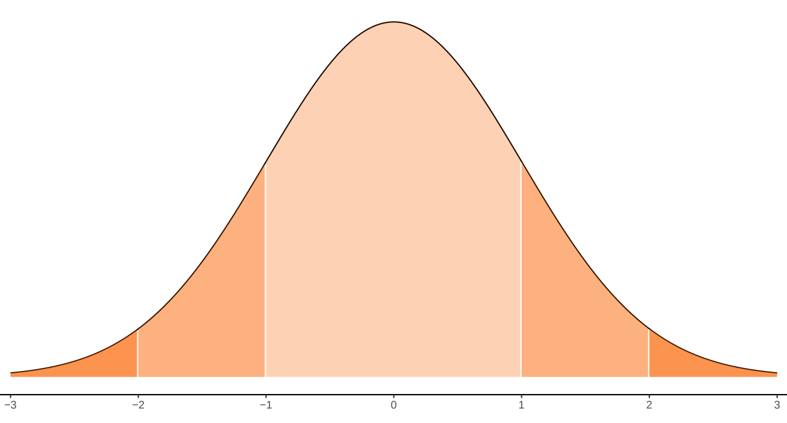

```{r setup, include=FALSE}
knitr::opts_chunk$set(echo = TRUE, message = FALSE, warning = FALSE, comment = NA)
```

# **Modelos continuos**

<br/><br/>

## **Algunos modelos continuos**

Las variables continuas proceden en su mayoría de la medición y se clasifican así debido a que su rango esta formado por un conjunto infinito no numerable. A continuación se presentan los principales modelos continuos.

<br/>

|                 |                 |                 |                 |                 |                 | 
|:---------------:|:---------------:|:---------------:|:---------------:|:---------------:|:---------------:|
| Uniforme        |   Normal        |  Exponencial    |  Gamma          |  Weibull        | Cauchy          |
| Lognormal       |   Beta          | Erlang          |  Gumbel         |  Kernel	        |                 |
|                 |                 |                 |                 |                 |                 |


<br/><br/>

## **uniforme**

<br/>

<div style="padding: 15px; border: 1px solid transparent; border-color: transparent; margin-bottom: 20px; border-radius: 4px; color: #000000; background-color: #FFFFFF ; border-color: #000000;">

**Distribución uniforme**
	
Se caracteriza porque su función de densidad es constante en su recorrido o dominio de definición (intervalo [a,b])

$$\begin{equation*}
		f(x)=\left\lbrace
		\begin{array}{lll}
			\dfrac{1}{b-a}	 &,& a \leq x \leq b   \\
			&&\\
			0 &,& \mbox{en otro caso}
		\end{array}
		\right.
	\end{equation*}$$

</div> 

<br/><br/>

**Distribución uniforme ($0,1$)**

```{r, echo=FALSE, fig.height=3.5}
# uniforme
library(ggplot2)
x= c(0,1) 
fx=c(1,1) 
dat=data.frame(x,fx)
ggplot(data=dat,aes(x=x, y=fx))+ 
  scale_y_continuous(limits=c(0,1.2))+
  geom_line(size = 1, color="#BC2B6A") 
```

**Ejemplo**

En la fabricación de portaobjetos, que son láminas rectangulares de vidrio muy delgada (76x26 mm y 1 mm de espesor), utilizados para  la observación de sustancias en el microscopio. Una de sus principales características está relacionada con su espesor ($X$), el cual tiene una distribución uniforme entre 0.95 mm y 1.05 mm. Determine la probabilidad de que un portaobjeto determinado tenga un espesor superior a 1.03 mm.|          

<br/><br/>

**Solución** 

 $$P(X\geq 1.03)= (1.05-1.03) \times \frac{1}{0.10}=0.20 $$

<br/><br/>

## **normal**

La distribución normal es uno de los modelos más utilizados en las aplicaciones de la Estadística. Estas aplicaciones están relacionadas con:

Usos de la distribución normal

* La mayoría de variables en la naturaleza, se distribuyen aproximadamente de manera normal

* A partir de la distribución normal se originan las distribuciones $t-student$, $\chi^{2}$ y $F$-Fisher, utilizadas en inferencia estadística

* En general la media muestral de variables que no tienen distribución normal, tiende a aproximarse a una distribución normal, a medida que el tamaño de muestra aumenta. (Teorema del Límite Central) 

* La regla empírica establece que:

    *	Aproximadamente el 68\% de la población se encuentra en el intervalo centrado $$(\mu - \sigma ; \mu + \sigma)$$

		* Aproximadamente el 95\% de la población se encuentra en el intervalo centrado $$(\mu - 2\sigma ; \mu + 2\sigma)$$

		* Aproximadamente el 99.7\% de la población se encuentra en el intervalo centrado $$(\mu - 3\sigma ; \mu + 3\sigma)$$

Su distribución fué planteada por el matemático francés del siglo 18, Abraham de Moivre, quien a partir de la distribución Binomial, con $n=2$ empezó a aumentar su tamaño hasta observar que se formaba una distribución en forma de campana. Este mismo comportamiento fué detectado por Galileo en el siglo 17, al observar los errores producto de sus mediciones en astronomía. El modelo como se conoce actualmente fue propuesto de manera simultánea por los cientificos Robert Adrain y Carl Friedrich Gauss, quien finalmente le dió el nombre.

Su función de densidad esta dada por:

<br/>

<div style="padding: 15px; border: 1px solid transparent; border-color: transparent; margin-bottom: 20px; border-radius: 4px; color: #000000; background-color: #FFFFFF ; border-color: #000000;">

**Distribución normal**
	
$$f(x)= \dfrac{1}{\sqrt{2\pi \sigma^{2}}} \hspace{.1cm} e^{-\big(\frac{1}{2\sigma^{2}}(x-\mu)^{2}\big)}	 \hspace{.5cm}  -\infty \leq  x \leq \infty $$  
	
$$E[X]=\mu$$
$$V[X]=\sigma^{2}$$

</div> 


<br/><br/>

En la siguente gráfica se muestra el efecto en la curva normal, producto de cambios en la media o en la varianza. A mayor valor de la media la curva se desplaza a la derecha, mientras que a menor varianza la curva se vuelve mas angosta o puntiaguda 

Distribuciones normales : <span style="color:blue">$N(0,1)$</span>, <span style="color:red"> $N(0,1.5)$</span> y <span style="color:orange"> $N(2,1.5)$</span>

```{r, echo=FALSE, fig.height=3.5}
# Distribucion normal
library(ggfortify)

p=ggdistribution(dnorm, seq(-4, 8, 0.1), mean = 0, sd = 1,colour = 'blue')
p=ggdistribution(dnorm, seq(-4, 8, 0.1), mean = 0, sd = 1.5,colour = 'red', p=p)
ggdistribution(dnorm, seq(-4, 8, 0.1),   mean = 2, sd = 1.5,colour = 'orange', p=p)
```


Dentro del sin número de posibles curvas que se pueden obtener con los parámetros $\mu$ y $\sigma^{2}$, existe una muy especial. Normal estándar ($N(0,1)$) con $\mu=0$ y $\sigma^{2}=1$.  La gran mayoría de libros de Estadística poseen tablas de la función de distribución acumulada de la normal estándar.\\


<div style="padding: 15px; border: 1px solid transparent; border-color: transparent; margin-bottom: 20px; border-radius: 4px; color: #000000; background-color: #FFFFFF ; border-color: #000000;">

**Distribución normal estandar N(0,1)**

Su función de distribución esta dada por :

$$f(x)= \dfrac{1}{\sqrt{2\pi}} \hspace{.1cm} e^{-\big(\frac{1}{2}(x-\mu)^{2}\big)}	 \hspace{.5cm}  -\infty \leq  x \leq \infty $$ 

Si $X \sim N(\mu, \sigma^{2})$, entonces $Z= \dfrac{X-\mu}{\sigma} \sim N(0,1)$ 

a este proceso se le llama comúnmente estandarizar.

</div> 


**normal estándar**

```{r, echo=FALSE, fig.height=3.5}
library(ggfortify)
ggdistribution(dnorm, seq(-4, 4, 0.1), mean = 0, sd = 1,fill = 'blue')
```

<br/><br/>


La propiedad empírica de la distribución normal es de gran ayuda cuando una variable  de interés se  puede aproximar al modelo normal. Ella establece un intervalo formado por la media mas o menos una desviación estándar contiene el 68\% de los datos. Si el intervalo tiene un ancho de 4 desviaciones estándar contendrá el 95\% de los datos y si este intervalo corresponde a los valores de la media mas o menos 3 desviaciones estándar contendrá el 99\% de los datos que se representa en la siguiente gráfica.


**Propiedad empírica de la distribución normal estandar**


```{r, echo=FALSE, out.width="70%", fig.align = "center"}

```

<br/><br/>

**Ejemplo**

La velocidad de transferencia de archivos desde un servidor en el campus de la universidad a un ordenador personal en casa de un estudiante en un día laborable, se distribuye normalmente con una media de 60 kilobits por segundo y una desviación estándar de 4 kilobits por segundo. ¿Cuál es la probabilidad de que el archivo se transfiera a una velocidad de 70 kilobits por segundo o más? |

<br/><br/>

**Solución** 

Para una variable $X$ con distribución $N(60,16)$, debemos calcular la probabilidad $P(X \geq 70)$ \\

$$\begin{eqnarray*}
	P(X \geq 70)&=&P\Bigg(\dfrac{X-\mu}{\sigma} \geq \dfrac{70-60}{4}\Bigg)\\
	&=& P\Bigg(Z \geq \dfrac{70-60}{4}\Bigg)\\
	&=& P(Z\geq 2.5)=1-P(Z < 2.5 )\\
	&=& 1-0.9938=0.0062
\end{eqnarray*}$$

En R se utiliza el siguiente código: 

```{r }
pnorm(70, mean=60, sd=4, lower.tail=FALSE)
```

<br/><br/>


## **exponencial** 

Este modelo fue  planteado por el matemático estadístico e ingeniero Agner Kraru Erlang, experto en el trafico de las comunicaciones y la teoría de colas. 
Distribución utilizada para modelar el tiempo entre dos eventos consecutivos. 


<br/>

<div style="padding: 15px; border: 1px solid transparent; border-color: transparent; margin-bottom: 20px; border-radius: 4px; color: #000000;background-color: #FFFFFF ; border-color: #000000;">

**Distribución exponencial**
	
$$\begin{equation*}
		f(x)=\left\lbrace
		\begin{array}{lll}
			\lambda e^{-\lambda x}  &,& x > 0   \\
			&&\\
			0 &,& x \leq 0 
		\end{array}
		\right.
	\end{equation*}$$
	
	
$$E[X]=\dfrac{1}{\lambda}$$
	
$$V[X]=\dfrac{1}{\lambda^{2}}$$
	
Observación: algunos autores utilizan $\frac{1}{\beta}$ en lugar de $\lambda$
	
$$F(x)=P(X \leq x)=1-e^{-\lambda x} \hspace{1cm} x > 0$$

</div> 

<br/><br/>


Distribuciones exponenciales : <span style="color:blue"> $exp(1)$</span>, <span style="color:red"> $exp(2)$</span> y <span style="color:orange"> $exp(5)$</span>

```{r, echo=FALSE, fig.height=3.5}
#exponencial
library(ggfortify)
p=ggdistribution(dexp, seq(0, 10, 0.1),rate=1 ,colour = 'blue')
p=ggdistribution(dexp, seq(0, 10, 0.1),rate=2 ,colour = 'red', p=p)
ggdistribution(dexp, seq(0, 10, 0.1),rate=0.5,colour = 'orange', p=p)
```
 

**Distribuciones exponenciales acumuladas**


```{r, echo=FALSE, fig.height=3.5}
library(ggfortify)
ggdistribution(pexp, seq(0, 10, 0.1),rate=1 ,colour = 'blue')
```

<br/><br/>

**Ejemplo**

El tiempo entre llamadas de los clientes a una empresa de turismo ecológico tiene una distribución exponencial con un tiempo medio entre llamadas de 15 minutos. ¿Cuál es la probabilidad de que transcurra más de 20 minutos antes de que se realiza una nueva llamada? (Ejemplo 8 4-77 Mongomery) |

<br/><br/>

**Solución**

$X$: el tiempo entre dos llamadas consecutivas $\lambda=\frac{1}{15}$ minutos. 

$$\begin{eqnarray}
	P(X \geq 20) &=& 1-P(X < 20) \\
	&=& 1-(1-e^{-\frac{20}{15}}) \\
	&=& 0.2636 
\end{eqnarray}$$

En R se utiliza el siguiente código: 

```{r}
 pexp(20,1/15, lower.tail=FALSE)
```


Para tratar las distribuciones Gamma y Weibull, es necesario definir la función Gamma como:

$$\Gamma(r)= \int_{0}^{\infty} t^{r-1} e^{t} \,dt $$

Con las siguientes propiedades:


* Si $r$ es un entero, $\Gamma(r)=(r-1)!$

* para cualquier valor de $r$, $\Gamma(r+1)=r \Gamma(r)$

* $\Gamma(1/2)=\sqrt{\pi}$

* $\Gamma(1)=1,\hspace{.1cm} \Gamma(2)=1, \hspace{.1cm} \Gamma(3)=2, \hspace{.1cm}\Gamma(n+1)=n!$


<br/><br/>

## **gamma**

Esta distribución tiene su origen en la familia de curvas sesgadas propuestas por Karl Pearson. Esta distribución es otra alternativa para modelar los tiempos de espera de ocurrencia de sucesos o eventos. En ocasiones puede relacionarse con la suma de los tiempos de variables exponenciales sucesivas con igual media.

<br/><br/>

<div style="padding: 15px; border: 1px solid transparent; border-color: transparent; margin-bottom: 20px; border-radius: 4px; color: #000000;background-color: #FFFFFF ; border-color: #000000;">

**Distribución gamma**

La distribución Gamma se obtiene al sumar $r$ variables con distribución exponencial con parámetro $\lambda$. 

Distribución 

Si $Y=X_{1}+X_{2}+....+X_{r}$, $X_{i} \sim Exp(\lambda)$, entonces $Y \sim \Gamma(r,\lambda)$.
	
$$\begin{equation*}
		f(x)=\left\lbrace
		\begin{array}{lll}
			\dfrac{\lambda^{r}x^{r-1} e^{-\lambda x}}{\Gamma(r)}  &,& x > 0   \\
			&&\\
			0 &,&   x \leq 0
		\end{array}
		\right.
	\end{equation*}$$

	
Distribuciones exponenciales gamma(3,1)}, gamma(2,1) y gamma(5,1)
fig_gammas.pdf

Algunos autores utilizan $\frac{1}{\beta}$ en lugar de $\lambda$ y $\alpha$ en lugar de $r$


$$E[X]=\dfrac{r}{\lambda}$$
$$V[X]= \dfrac{r}{\lambda^{2}}$$

</div> 

<br/><br/>

Distribuciones : <span style="color:blue"> $gamma(3,1)$</span>, <span style="color:red">$gamma(2,1)$</span> y <span style="color:orange"> $gamma(5,1)$</span>

```{r, echo=FALSE, fig.height=3.5}
# gamma
library(ggfortify)
p=ggdistribution(dgamma, seq(0, 15, 0.1),shape=3,rate=1 ,colour= 'blue')
p=ggdistribution(dgamma, seq(0, 15, 0.1),shape=2,rate=1 ,colour = 'red', p=p)
ggdistribution(dgamma, seq(0, 15, 0.1),shape=5,rate=1,colour = 'orange', p=p)

```


**Ejemplo**

 En cierta ciudad el consumo diario de energía eléctrica, en millones de kilovatios por hora, puede considerarse como una variable aleatoria con distribución Gamma de parámetros $r= 3$ y $\lambda= 0.5$. La planta de energía de esta ciudad tiene una capacidad diaria de 10 millones de KW/hora. ¿Cuál es la probabilidad de que este abastecimientos sea insuficiente en un día cualquiera?.|


<br/><br/>

**Solución**

$X$: consumo diario de energia

$$\begin{eqnarray*}
	P(X > 10)&=& 1-P(X \leq 10) \\
	&=& 1 - \dfrac{1}{\Gamma(3)} \int_{0}^{10} (0.5)^{3}  x^{3-1} e^{-0.5x} \,dx \\
	&=& 0.124652
\end{eqnarray*}$$


```{r}
pgamma(10,3,0.5, lower.tail = FALSE)
```

<br/><br/>

## **Weibull** 

Esta distribución fue descubierta Maurice Frechet matemático francés y luego trabajada por  Rosin y Rammler quienes en 1933 estudiaron el tamaño de una partícula y posteriormente recibe su nombre del  ingeniero y matemático Waloddi Weibull . Esta distribución se utiliza para modelar el tiempo de vida de algunos componentes. La Weibull tiene dos parámetros $\alpha$ y $\beta$. Su función de distribución y sus principales características son:


<div style="padding: 15px; border: 1px solid transparent; border-color: transparent; margin-bottom: 20px; border-radius: 4px; color: #000000;background-color: #FFFFFF ; border-color: #000000;">

**Distribución Weibull** 

$$\begin{equation*}
		f(x)=\left\lbrace
		\begin{array}{lll}
			\Bigg(\dfrac{\alpha}{\beta}\Bigg)\Bigg(\dfrac{x}{\beta}\Bigg)^{\alpha-1}\exp{\Bigg\{-\Big(\dfrac{x}{\beta}\Big)^{\alpha}\Bigg\}}&,& x > 0\\
			&&\\
			0 &,& x \leq 0
		\end{array}
		\right.
	\end{equation*}$$
	
$$E[X]=\beta \hspace{.2cm}\Gamma\Bigg(1+\frac{1}{\alpha}\Bigg)$$

$$V[X]=\beta^{2} \Bigg(\Gamma\Bigg(1+\frac{2}{\alpha}\Bigg)- \Bigg[\Gamma \Bigg(1+\frac{1}{\alpha}\Bigg)\Bigg]^{2}\Bigg) $$

$$F(x)=1-\exp{\Big\{-\Big(\dfrac{x}{\beta}\Big)^{\alpha}\Big\}} $$	
	
</div> 

Distribuciones : <span style="color:blue"> $Weibull(0.8, 1)$</span>, <span style="color:red"> $Weibul(2,1)$</span> y <span style="color:orange"> $Weibull(2,2)$</span>

```{r, echo=FALSE, fig.height=3.5}
# weibull
library(ggfortify)
p=ggdistribution(dweibull, seq(0, 5, 0.01),shape=0.8,scale=1 ,colour = 'blue')
p=ggdistribution(dweibull, seq(0, 5, 0.01),shape=2,scale=1 ,colour = 'red', p=p)
ggdistribution(dweibull, seq(0, 5, 0.01),shape=2,scale=2,colour = 'orange', p=p)
```


<br/><br/>


La siguiente gráfica corresponde a varias conformaciones de los parámetros de esta distribución.

Distribuciones exponenciales \textcolor{col4}{Weibull(0.8,1)}, \textcolor{col5}{Weibull(2,1)} y \textcolor{col3}{Weibull(2,2)}
fig_weibulls.pdf


Función de riesgo 
	
Se llama así a la tasa de fallas por unidad de tiempo, expresada como la proporción de elementos que no han fallado

$$h(t)=\dfrac{f(t)}{1-F(t)} $$
<br/><br/>

**Ejemplo**

La duración de una batería se modela mediante una distribución Weibull con parámetros: $\alpha=0.1$ y $\beta=2$. Determine la probabilidad de que una batería dure más de 10 horas. Determine la proporción de baterías que durarán más de 10 horas. |


<br/>

**Solución**

$$\begin{eqnarray*}
	P(X > 10) &=& 1- F(10)\\
	&=& 1-\Big(1-e^{-[10/2]^{0.1}}\Big)\\
	&=& -e^{[5]^{0.1}}\\
	&=& 0.3089367 
\end{eqnarray*}$$

<br/><br/>

En este caso también se puede obtener  la tasa de fallos esta determinada por:
$$\begin{eqnarray*}
	h(10)&=&\dfrac{f(10)}{1-F(10)}\\
	&&\\
	&=& \dfrac{0.003628829}{1-0.6910633}\\
	&&\\
	&=& 0.01174619
\end{eqnarray*}$$

<br/><br/>

