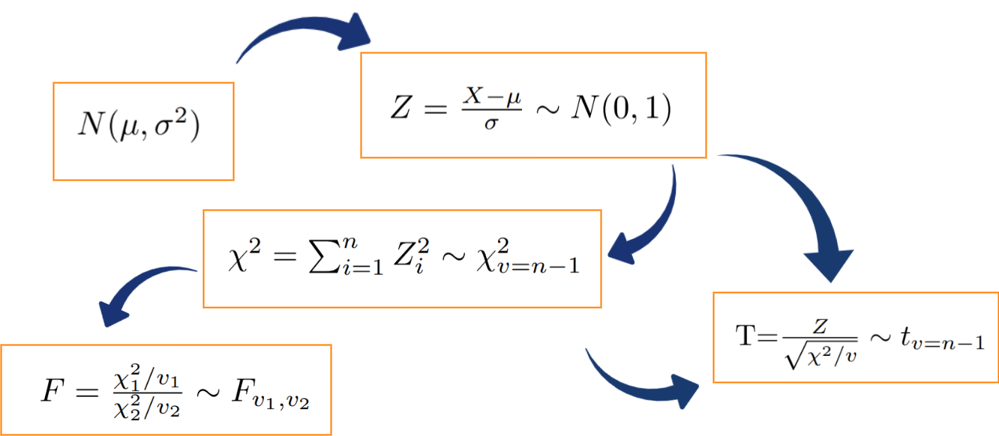

```{r setup, include=FALSE}
knitr::opts_chunk$set(echo = TRUE, message = FALSE, warning = FALSE, comment = NA)
```

<br/><br/>

La estimación se realiza cuando no conocemos el valor de un parámetro poblacional y lo podemos realizar de manera puntual (un solo valor) o mediante un intervalo de confianza.


# **Métodos de estimación**

<br/><br/>


El método de momentos fue propuesto por Karl Pearson al rededor de 1895, pensado en sus inicios en contexto descriptivo, analizando las distribuciones de probabilidad y aprisionándolas al sistema de curvas que llevan su nombre. Posteriormente este concepto fue modificado por R.A. Fisher en 1920. El método consiste en estimar un parámetro de una distribución igualando sus momentos teóricos o poblacionales, si existen, con los correspondientes momentos muestrales.

Para mostrar este método es necesario definir el concepto de momento.

<br/>

## **Momento Poblacional** 

| Caso discreto                           |Caso continuo                          |
|:---------------------------------------:|:-------------------------------------:|
|$$\mu^{k}=E\big[X^{k}\big]=\sum_{Rx} x^{k}p(x)$$ |$$\mu^{k}=E\big[X^{k}\big]=\int_{-\infty}^{\infty}x^{k}f(x) dx $$ |


###  **Momentos muestrales** 

En ambos casos 

$$m^{k}=\frac{1}{n}\sum_{i=1}^{n} x_{i}^{k} $$ 

<br/>

El método de momentos supone que los momentos tanto poblacionales como muestrales son conocidos, y por lo tanto también la función de probabilidad. 

A continuación se relacionan algunos de estos momentos poblacionales:

<br/>

| Distribución | $E[X]$               | $V[X]=E[X^{2}]-E[X]^{2}$        |
|:-------------|:---------------------|:--------------------------------|
| bernoulli    | $p$                  | $pq$                            |
| geométrica   | $\displaystyle\frac{1}{p}$ | $\displaystyle\frac{q}{p^{2}}$  |
| binomial     | $np$                 | $npq$                           |
| Poisson      | $\lambda$            | $\lambda$                       | 
| gamma        | $\alpha\beta$        | $\alpha\beta^{2}$               |
| exponencial  | $\beta$              | $\beta^{2}$                     | 
| uniforme     | $\displaystyle\frac{a+b}{2}$| $\displaystyle\frac{(b-a)^{2}}{12}$ |
| normal       | $\mu$                |$\sigma^{2}$                     |


<br/>

Nota: Existe una relación entre las distribuciones Poisson y exponencial.Se podrían dar en función de $\lambda$, haciendo $\beta=\dfrac{1}{\lambda}$  

<br/><br/>

### <span style="color:#FF7F00"> **Ejemplo**</span>

<br/>

Encuentre los estimadores de los parámetros de la distribución normal a través del método de momentos.
Previamente sabemos que los parámetros de una variable con distribución normal son $E[X]=\mu$ y $V[X]=\sigma^{2}$ y que $V[X]=E[X^{2}]-E[X]^{2}$. Dada esta información el estimador de momentos se construye de la siguiente manera: 

$$M^{1}=m^{1}$$

$$M^{2}=m^{2}$$

Aplicando el método:

<br/>

|                                                    |
|:---------------------------------------------------|
|$$M^{1}= m^{1}$$ |
|$$\mu  =  \displaystyle\frac{1}{n}\sum_{i=1}^{n}x_{i}$$|
|$$\widehat{\mu} = \displaystyle\frac{1}{n}\sum_{i=1}^{n} x_{i}=\bar{x}$$|


<br/>

Para estimar $\sigma^{2}$, se realiza el siguiente procedimiento, usando $\mu^{1}=m^{1}$  y $\mu^{2}=m^{2}$.

$$V[X]=E[X^{2}]-E[X]^{2} = \mu^{2}-(\mu^{1})^{2}$$

entonces igualamos estos dos momentos poblacionales con sus respectivos momentos muestrales quedando la igualdad

$$\begin{eqnarray*}
	V[X]&=& \mu^{2}-(\mu^{1})^{2}\\
	&=&m^{2}-(m^{1})^{2}\\
	&=&\displaystyle\frac{1}{n}\sum_{i=1}^{n}x_{i}^{2}-\bar{x}^{2}
\end{eqnarray*}$$

podemos representar la varianza por $\sigma^{2}$ y obtenemos

$$\widehat{\sigma^{2}}=\displaystyle\frac{1}{n}\sum_{i=1}^{n}x_{i}^{2}-\bar{x}^{2}$$

y obtenemos el estimador de la varianza:

<br/>

|                       |                                                                                                   |
|----------------------:|:--------------------------------------------------------------------------------------------------|
|$\widehat{\sigma^{2}}$ | $= \displaystyle\frac{1}{n}\sum_{i=1}^{n}x_{i}^{2}-\bar{x}^{2}$                                   |
|$\widehat{\sigma^{2}}$ | $= \displaystyle\frac{1}{n}\sum_{i=1}^{n}x_{i}^{2}-\bar{x}^{2}-\bar{x}^{2}+\bar{x}^{2}$           |
|                       | $= \displaystyle\frac{1}{n}\sum_{i=1}^{n}x_{i}^{2}-2\bar{x}^{2}+\bar{x}^{2}$                      |
|                       | $= \displaystyle\frac{1}{n}\sum_{i=1}^{n}x_{i}^{2}-\displaystyle\frac{2\bar{x}\sum x_{i}}{n}+\displaystyle\frac{n \bar{x}^{2}}{n}$ |
|                       | $= \displaystyle\frac{1}{n}\Big(\sum_{i=1}^{n} x_{i}^{2}-2\bar{x}\sum_{i=1}^{n} x_{i}+\bar{x}^{2}\Big)$ |
|                       | $= \displaystyle\frac{1}{n}\sum_{i=1}^{n}\Big(x_i-\bar{x}\Big)^{2}$        |

<br/><br/>

En resumen los estimadores de momentos para los parámetros de la distribución normal son:


$$\widehat{\mu} = \displaystyle\frac{1}{n}\sum_{i=1}^{n} x_{i}=\bar{x}$$

$$\widehat{\sigma^{2}} = \displaystyle\frac{1}{n}\sum_{i=1}^{n}\Big(x-\bar{x}\Big)^{2}$$ 


A partir de ellos y mediante la obtención de una muestra aleatoria por ejemplo :630, 650, 710, 750, 790, 820, 860 y 910 se pueden estimar los parámetros por método de momentos con los siguientes resultados:

$$\widehat{\mu}=765$$  

$$\widehat{\sigma^{2}}=8550$$


## **Método de Máxima Verosimilitud**

Uno de los mejores métodos para obtener un estimador puntual de un parámetro es el método de **Máxima Verosimilitud** o de máxima probabilidad. Esta técnica fue desarrollada en 1920 por el estadístico britanico Sir R.A. Fisher, afirmando que el estimador será el valor del parámetro que maximice la función de verosimilitud $L(\theta)$. \\ \\

La función de verosimilitud $L(\theta)$ corresponde a la función de distribución conjunta de variables aleatorias independientes con igual función de distribución. Estas variables aleatorias corresponden a las variables que conforman la muestra.
%
$$L(\theta)=f(x_{1},\theta).f(x_{2},\theta).f(x_{3},\theta)....f(x_{n}),\theta)$$
El objetivo del método será encontrar el valor del parámetro que maximice la probabilidad conjunta, suponiendo el conocimiento de la función de distribución de probabilidad de la variable en estudio. 

</br></br>

### <span style="color:#FF7F00"> **Ejemplo**</span>

Para el caso de la distribución normal cuya función de distribución de probabilidad esta dada por :

$$f(x_{i})=\frac{1}{\sqrt{2\pi}\sigma^{2}} \exp{\Bigg(-\frac{1}{2\sigma^{2}}\big(x_{i}-\mu\big)^{2}\Bigg)}$$
La función de verosimulitud estará dada por:

$$L(x_{1},x_{2},..,x_{n};\mu,\sigma^{2})=f(x_{1};\mu,\sigma^{2})....f(x_{n};\mu,\sigma^{2})$$

Esta función se puede escribir como :

$$L(x_{1},\cdots,x_{n};\mu,\sigma^{2})=\displaystyle\prod_{i=1}^{n} \frac{1}{\sqrt{2\pi\sigma^{2}}}\exp{\Bigg(-\frac{1}{2\sigma^{2}}\big(x_{i}-\mu\big)^{2}\Bigg)} $$

$$L=\displaystyle\Big(\frac{1}{2\pi \sigma^{2}}\Big)^{n/2} \exp \Bigg(\sum_{i=1}^{n}\frac{-1}{2\sigma^{2}}(x_{i}-\mu)^{2}\Bigg) $$

$$L=\displaystyle\Big(2\pi \sigma^{2}\Big)^{-n/2} \exp \Bigg(\frac{-1}{2\sigma^{2}}\sum_{i=1}^{n}(x_{i}-\mu)^{2}\Bigg) $$

El método consiste en encontrar el valor del parámetro que maximice esta función para lo cual procedemos a derivar $L$ parcialmente con respecto al parámetro objetivo, por ejemplo $\mu$.

Este proceso presenta algunas dificultades de cálculo que son atenuadas mediante la premisa de que el *máximo de la función $L$ corresponde a los mismos máximos de la función $\ln(L)$*, la cual es más sencilla de derivar. Este procedimiento es posible debido a que la función $L$ es creciente.

Convertimos $L$ en $ln(L)$

$$\ln(L)= -\displaystyle\frac{n}{2} \ln(2\pi) - \displaystyle\frac{n}{2} \ln(\sigma^{2}) -\displaystyle\frac{1}{2\sigma^{2}}\displaystyle\sum_{i=1}^{n}(x_{i}-\mu)^{2}$$
Al derivar parcialmente $\ln(L)$ con respecto a $\mu$ tenemos:

$$\displaystyle\frac{\partial \ln(L)}{\partial \mu}= \displaystyle\frac{2}{2\sigma^{2}}  \displaystyle\sum_{i=1}^{n} (x_{i}-\mu) =0$$

De esta igualdad se despeja el parámetro de interés

$$\sigma^{2} \hspace{.2cm} \frac{1}{\sigma^{2}}\sum_{i=1}^{n} (x_{i}-\mu) =0 \hspace{.2cm}  \sigma^{2} $$
$$\sum_{i=1}^{n} x_{i} - n \mu =0$$

$$\widehat{\mu}=\frac{1}{n}\sum_{i=1}^{n} x_{i} = \bar{x}$$

En el caso de la estimación de $\sigma^{2}$, se deriva $\ln(L)$ parcialmente con respecto a $\sigma^{2}$, se iguala a cero el resultado obtenido y por último se despeja $\sigma^{2}$. Verifique que el estimador de máxima verosimilitud para la varianza es igual a:

$$\widehat{\sigma^{2}}=\frac{1}{n}\sum_{i=1}^{n} \big(x_{i}-\mu \big)^{2} $$
<br/><br/><br/>


## **Distribuciones muestrales**

<br/>

### **Principales distribuciones muestrales**: 

+ normal
+ Chi-cuadrado, 
+ t-student, 
+ F-Fisher


Se denomina distribución muestral a la distribución que sigue los principales estimadores puntuales o funciones de ellos como son:

$$\bar{X},\hspace{.2cm} \widehat{p}, \hspace{.2cm}\frac{(n-1)S^ {2}}{\sigma^{2}}, \hspace{.2cm} Z=\frac{\bar{X}-\mu}{S/\sqrt{n}}, \hspace{.2cm} F=\frac{\chi^ {2}_{1}/v_{1}}{\chi^{2}_{2}/v_{2}}$$

Existe una relación importante entre ellas con la Distribución normal, las cuales se representan en el siguiente diagrama:

<br/>


```{r, echo=FALSE, out.width="70%", fig.align = "center"}

```

</br></br>

Si una variable **X** se distribuye **normal** con parámetros $\mu$ y $\sigma^{2}$, entonces a partir de su transformación se puede obtener una variable **Z** que tenga distribución **normal estándar** $N(0,1)$, que tiene media cero y varianza uno. Varias normales estándar al cuadrado conforman una variable con distribución **chi-cuadrado** y a su vez esta variable tiene la propiedad tal que la suma de $n$ variables aleatorias $\chi^{2}$ con $n-1$ grados de libertad. La razón de una variable con distribución normal estándar y la raíz cuadrada de una variable chi-cuadrado, dividida por sus grados de libertad originan una variable con distribución **t-student**. Por último la razón de dos variables con distribución chi-cuadrado, divididas cada una por sus respectivos grados de libertad, generan una variable con distribución  **F-Fisher**. 

En sintesis, la distribuciones de muestreo básicas, tienen de base la distribución normal.

<br/><br/>

## **Distribución chi-cuadrado** 

<br/>

Si $S^{2}$ es la varianza de la muestra aleatoria de tamaño $n$ que se toma de una población normal que tiene varianza $\sigma^{2}$, entonces el estadístico:
$$\chi^{2}=\frac{(n-1)S^{2}}{\sigma^{2}}=\sum_{i=1}^{n}\frac{\big(x_{i}-\bar{x}\big)^{2}}{\sigma^{2}}=\sum_{i=1}^{n} \Big(\frac{x_{i}-\bar{x}}{\sigma}\Big)^{2} $$
tiene una distribución chi-cuadrado con $v=n-1$ grados de libertad.


Nota: Esta función fue creada por Karl Pearson científico inglés (1857-1936) y su función de distribución y su representación gráfica están dadas por:

$$f(x)=\frac{1}{2^{(v/2)}\Gamma(v/2)}x^{(v/2)-1}\exp\{-x/2\} ,\hspace{.3cm} x>0$$
<br/><br/>

```{r, echo=FALSE}
curve(dchisq(x, df=7), lwd=3, las=1,xlim = c(0,30), ylim=c(0,.13), ylab='Densidad', col="#FF7F00",axes = FALSE)
curve(dchisq(x, df=9), lwd=3, las=1,xlim = c(0,30), ylab='Densidad',add = TRUE, col="#034A94")
curve(dchisq(x, df=11), lwd=3, las=1,xlim = c(0,30), ylab='Densidad',add = TRUE, col="686868")
abline(h=0)
grid()
```

Esta distribución es un caso especial de la distribución Gamma con parámetros $\alpha=\frac{v}{2}$ y $\beta=2$ 

<br/><br/>

## **Distrución t-student**

<br/>

Esta función nace de la relación entre una variable con distribución normal estándar y la raíz cuadrada de una variable con distribución chi-cuadrado
Sea Z una variable con distribución normal estándar y V una variable con distribución chi-cudadrado con v grados de libertad, entonces la variable aleatoria T se distribuye t-student con v grados de libertad

$$T=\frac{Z}{\sqrt{V/v}} \sim t_{v}$$


Nota: Esta función de distribución fue propuesta por William Sealy Gosset en 1908. Gosset trabajaba en una fábrica de cerveza de prppiedad de Guiness, quien prohibía a sus empleados la publicación de artículos cientificos debido a la difución previa de secretos industriales. Debido a esta prohibición Gosset publicaba sus artículos con el seudónimo de Student.(Wikipedia.org)

La función de probabilidad de distribución t-student y su representación gráfica están dadas por:

$$f(x)=\frac{\Gamma[(v+1)/2]}{\Gamma[v/2]\sqrt{\pi v}}\Bigg(1+\frac{x^{2}}{v} \Bigg)^{-(v+1)/2}, \hspace{.3cm} -\infty< x<\infty $$

```{r, echo=FALSE}
curve(dt(x, df=1), lwd=3, las=1,xlim = c(-4,4), ylim=c(0,0.4), ylab='Densidad', col="#FF7F00",axes = FALSE)
curve(dt(x, df=5), lwd=3, las=1,xlim = c(-4,4), ylab='Densidad',add = TRUE, col="#034A94")
curve(dt(x, df=20), lwd=3, las=1,xlim = c(-4,4), ylab='Densidad',add = TRUE, col="#686868")
abline(h=0)
grid()
```

La gráfica de la distribución t-student es similar a la de la distribución normal, salvo que sus colas son más pesadas.

Si $X_{1},X_{2},...,X_{n}$ es una muestra aleatoria de $n$ variables independientemente e idénticamente distribuidas $N(\mu,\sigma^{2})$ y

$$\bar{X}=\frac{1}{n}\sum_{i=1}^{n}X_{i} $$

$$S^{2}=\frac{1}{n-1}\sum_{i=1}^{n}\Big(X_{i}-\bar{X}\Big)^{2} $$

Entonces la variable aleatoria:

$$T=\frac{\bar{X}-\mu}{S/\sqrt{n}} $$

tiene una distribución t-student con $v=n-1$ grados de libertad

<br/><br/>

## **Distribución F-Fisher**

<br/>

Si $S_{1}^{2}$ y $S_{2}^{2}$ son las dos varianzas de muestras aleatorias independientes de tamaños $n_{1}$ y $n_{2}$ tomadas de poblaciones normales con varianzas $\sigma_{1}^{2}$ y $\sigma_{2}^{2}$ respectivamente, entonces:

$$F=\frac{S_{1}^{2}/\sigma_{1}^{2}}{S_{2}^{2}/\sigma_{1}^{2}}=\frac{\sigma_{2}^{2}}{\sigma_{1}^{2}} \frac{S_{1}^{2}}{\sigma_{2}^{2}} $$

tiene una distribución F con grados de libertad $v_{1}=n_{1}-1$ y $v_{2}=n_{2}-1$\\


Nota: Ronald Aylmer Fisher (1890-1962) científico, matemático, estadístico, biólogo evolutivo y genetista inglés fue el creador de la distribución F. Su función de distribución y su representación gráfica están dadas por:

$$f(x)=\displaystyle\frac{\Gamma \Bigg[\displaystyle\frac{v_{1}+v_{2}}{2}\Bigg]\Bigg(\displaystyle\frac{v_{1}}{v_{2}}\Bigg)^{v_{1}/2} x^{(v_{1}/2)-1}}{\Gamma \Bigg[\displaystyle\frac{v_{1}}{2}\Bigg] \Gamma \Bigg[\displaystyle\frac{v_{2}}{2}\Bigg]
	\Bigg[\Bigg(\displaystyle\frac{v_{1}}{v_{2}}\Bigg)x+1\Bigg]^{\big(v_{1}+v_{2}\big)/2}}, \hspace{.3cm} x>0 $$


```{r, echo=FALSE}
curve(df(x, df1=5, df2=10), lwd=3, las=1,xlim = c(0,5), ylim=c(0,1), ylab='Densidad', col="#FF7F00",axes = FALSE)
curve(df(x, df1=10, df2=25), lwd=3, las=1,xlim = c(0,5), ylab='Densidad',add = TRUE, col="#034A94")
curve(df(x, df=20, df2=20), lwd=3, las=1,xlim = c(0,5), ylab='Densidad',add = TRUE, col="#686868")
abline(h=0)
grid()
```


<br/><br/>

## **Media muestral**

<br/>

$$ \bar{X}=\frac{1}{n}\sum_{i=1}^{n} X_{i}$$

Al hablar de distribución de probabilidad de la media muestral, implícitamente estamos afirmando que $\bar{X}$, es una variable aleatoria. De esta variable a continuación estudiaremos sus principales características. 

Para verificar las propiedades de este estimador podemos hacer uso de las propiedades del valor esperado de la siguiente manera:

$$\begin{eqnarray*}
	E\big[\bar{X}\big] &=& E\Bigg[ \frac{1}{n}\Big[X_{1}+X_{2}+\cdots + X_{n}\Big]\Bigg]\\  
	&=& \frac{1}{n} E\Big[X_{1}+X_{2}+\cdots + X_{n}\Big]\\
	&& \frac{1}{n} \Bigg[E\big[X_{1}\big]+E\big[X_{2}\big]+\cdots + E\big[X_{n}\big]\Bigg]\\
	&=&\frac{1}{n} \big[\mu + \mu \cdots + \mu \big] \\
	&=& \frac{1}{n} n\mu \\
	&=& \mu
\end{eqnarray*}$$

por tanto:

$$\mu = \mu_{\bar{X}}$$

Como conclusión obtenemos que la media de la media muestral es igual a la media de la variable. 

Con la varianza ocurre algo similar al utilizar las propiedades de la varianza:

$$\begin{eqnarray*}
	V[\bar{X}]&=&V\Bigg[\frac{1}{n} \sum_{i=1}^{n} x_{i}\Bigg] \\
	&=&\dfrac{1}{n^{2}} V\big[X_{1}+X_{2}+\cdots + X_{n}\big] \\
	&=& \dfrac{1}{n^{2}} V[X_{1}]+V[X_{2}]+\cdots +V[X_{n}]\\
	&=& \dfrac{1}{n^{2}} n\sigma^{2}\\
	&=& \dfrac{\sigma^{2}}{n}
\end{eqnarray*}$$

Se concluye que:

$$V[\bar{X}] = \dfrac{\sigma^{2}}{n}$$
<div>

Obtenemos así que la varianza de la media muestral es igual a la varianza de la variable. 


De estos resultados podemos concluir que:

* La media poblacional de la variable aleatoria $X$ es idéntica a la media de la media poblacional de la media $\bar{X}$

$$\mu_{_{X}} = \mu_{_{\bar{X}}}$$

* La varianza poblacional de $\bar{X}$ es igual la varianza de $X$ dividido por el tamaño de la muestra

$$\sigma^{2}_{_{\bar{X}}} = \dfrac{\sigma^{2}_{_{X}}}{n}$$
</div>

<br/><br/>


$$\text{factor por corrección por población finita : fcpf = } \dfrac{(N-n)}{(N-1)}$$

<br/><br/>

### <span style="color:#FF7F00"> **Ejemplo**</span>

<br/>

Cierto tipo de batería para automóviles dura un promedio de 1110 días con una desviación estándar de 80 días. Si se eligen n=400 de estas baterías de manera aleatoria, encuentre la probabilidad de que el **promedio del tiempo de duración** sea mayor a 1120 días.
Como $X \sim N(\mu=1110, \sigma^{2}=80^{2})$, utilizando las propiedades verificadas anteriormente podemos afirmar que: $\bar{X} \sim N(\mu=1110, \sigma_{\bar{X}}=80/\sqrt{400})$

$$\begin{eqnarray*}
	P(\bar{x} > 1120) &=& P\Bigg(\dfrac{\bar{x}-\mu}{\sigma/\sqrt{n}} > \dfrac{1120-1110}{80/\sqrt{400}}\Bigg)\\
	&=& P(Z > 2.5)\\
	&=& 1-P(Z < 2.5)\\
	&=& 1-0.9938 \\
	&=& 0.0068
\end{eqnarray*}$$


<br/><br/><br/><br/>

## **Proporción muestral**

<br/>

Al igual que en la media podemos realizar la verificación las características de la proporción


$$E[\hspace{.1cm}\widehat{p}\hspace{.1cm}]= p$$

$$V[\hspace{.1cm}\widehat{p}\hspace{.1cm}] =\dfrac{p(1-p)}{n}$$

<br/><br/>

### <span style="color:#FF7F00"> **Ejemplo**</span>

<br/>

La proporción de individuos con tipo de sangre Rh positivo es de 85%. Si se tiene una muestra de $n=500$ individuos, Encuentre la probabilidad de que la proporción muestral $\widehat{p}$ pase de 82%. Cuando el tamaño de muestra es grande, la distribución de la proporción se aproxima a una distribución normal con media $p$ y varianza $p(1-p)/n$. De esta manera podemos hallar la probabilidad solicitada:

$$\begin{eqnarray*}
	P(\widehat{p}>0.82) &=& P\Bigg(\dfrac{\widehat{p}-p}{(p(1-p)/\sqrt{n}} > \dfrac{0.82 - 0.84}{\sqrt{(0.85 \times 0.15)/500}}\Bigg) \\
	&=& P\big(Z > -1.878 \big) \\
	&=& 1 - P(Z < -1.88)\\
	&=& 1-0.0301
\end{eqnarray*}$$

<br/><br/>

## **Varianza muestral**.

<br/>

Ahora tenemos interes en estudiar el comportamiento de $S^{2}$ llamada cuasivarianza por algunos y definida por:

$$\widehat{\sigma^{2}}=S^{2}=\dfrac{1}{(n-1)}\sum_{i=1}^{n}\big(x_{i}-\bar{x}\big)^{2}$$


Se puede demostrar que:

$$E\big[S^{2}\big] = \sigma^{2}$$


$$V[S^{2}] = \dfrac{2\sigma^{4}}{(n-1)}$$


Pero también que:

$$\dfrac{(n-1) S^{2}}{\sigma^{2}} \sim \chi^{2}_{(v=n-1)} $$

Revisar : Canavos(1988) pp.231

<br/><br/><br/>


<div class="content-box-blue">
## **Algunos estimadores**

<br/>

| Parámetro         |  Estimador                        | Valor esperado              | Varianza                                              |
|:-----------------:|:---------------------------------:|:---------------------------:|:-----------------------------------------------------:|
| $\theta$          | $\widehat{\theta}$                | $E[\widehat{\theta}]$       | $V[\widehat{\theta}]$                                 |
| $\mu$             | $\bar{x}$                         |  $\mu$                      | $\displaystyle\frac{\sigma^{2}}{n}$                   |
| $p$               | $\widehat{p}=\frac{X}{n}$         | $p$                         | $\displaystyle\frac{pq}{n}$                           |
|$\sigma^{2}$       | $S^{2}=\displaystyle\frac{\displaystyle\sum_{i=1}^{n}(x-\bar{x})^{2}}{n-1}$ | $\sigma^{2}$|$\dfrac{2\sigma^{4}}{(n-1)}$ |
|$\mu_{1}-\mu_{2}$  | $\bar{x}_{1}-\bar{x}_{2}$         | $\mu_{1}-\mu_{2}$         |$\dfrac{\sigma^{2}_{1}}{n_{1}}+\dfrac{\sigma^{2}_{2}}{n_{2}}$ |
|$p_{1}-p_{2}$      | $\widehat{p_{1}}-\widehat{p_{2}}$ | $p_{1}-p_{2}$               |$\dfrac{p_{1}q_{1}}{n_{1}}+\dfrac{p_{2}q_{2}}{n_{2}}$ |

</div>

<br/><br/><br/>


