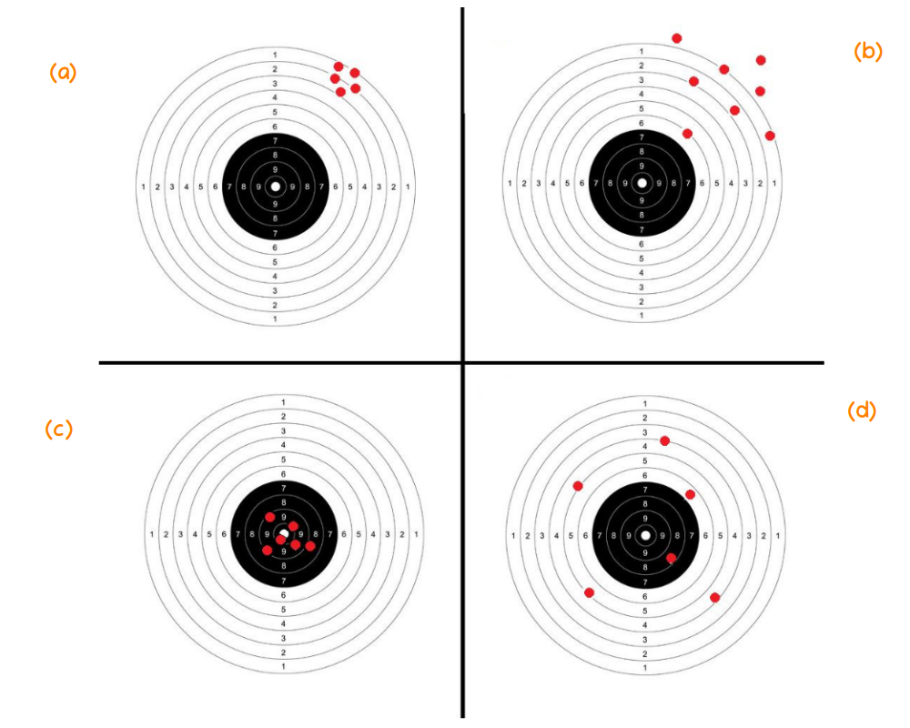

```{r setup, include=FALSE}
knitr::opts_chunk$set(echo = TRUE)
```

<br/><br/>

Los estimadores son variables aleatorias que toman su valor de los datos obtenidos en una muestra y que siguen una distribución conocida (distribuciones muestrales), pero además poseen propiedade deseables como son : insesgadez, eficiencia, consistencia entre otras. Con la siguiente figura se representa de manera figurativa lo que pueden ser estas propiedades 


```{r, echo=FALSE, out.width="70%", fig.align = "center"}

```

En el centro se ubica el parámeto desconocido y que tratamos de estimar utilizando para ello el estimador apropiado (figurativamente el arma que utilizamos).  En la figura 1 tenemos el resultado de un arma (estimador 1) que aunque tiene una alta precisión  ( poca varianza), presenta un desvio del centro  (sesgo). En la segunda figura se presenta el resultado de otra arma (estimador 2) que al igual que la primera que presenta un desvio del centro (sesgo), presenta una mayor varianza. La figura 3 representa el arma ideal (no tiene sesgo y poca varianza) y por último la figura 4 que en promedio diriamos que está centrada (no sesgo), presenta una variación alta.

Estas caractaristicas ahora en los estimadores se presentan a continuación:

<br/><br/>

### **Insesgadez**

<br/>

Un estimador $\widehat{\theta_{3}}$ se considera insesgado si $E[\widehat{\theta_{3}}] = \theta$

Está reprsentado por las figuras 3 y 4 que presentan un comportamiento que en promedio aciertan al centro

<br/><br/>

### **Eficiente**

<br/>

Un estimador  $\widehat{\theta_{1}}$ se considera eficiente, cuando dentro de todos los estimadores insesgados presenta la menor varianza:

$$V[\widehat{\theta_{3}}] < V[\widehat{\theta_{4}}]$$


<br/><br/>

### **Consistente**

<br/>

Cuando un estimador siendo sesgado, se convierte en un estimador sesgado cuando se aumenta el tamaño de la muestra, se dice que este estimador es consistente


$$\lim_{n \to{+}\infty} E[\widehat{\theta}] = \theta$$


<br/><br/>


**Ejemplo**

<br/>

Para una muestra obtenida de una población exponencial con parámetro $\beta$ ( $E[X]=\beta$, $V[X]=\beta^{2}$). Examinar los siguientes estimadores para una muestra de $n=4$ ($X_{1}$, $X_{2}$, $X_{3}$, $X_{4}$)

+ $\widehat{\theta}_{1} = \dfrac{1}{6}(X_{1}+X_{2}) \dfrac{1}{3}(X_{3}+X_{4})$

<br/>

+ $\widehat{\theta}_{2} = \dfrac{1}{10}(X_{1}+2X_{2} + 3X_{3} + 4X_{4})$

<br/>

+ $\widehat{\theta}_{3} = \dfrac{1}{4}(X_{1} + X_{2} + X_{3} + X_{4})$


Como se puede verificar  $\widehat{\theta}_{3}$ es el mejor estimador de los tres, siendo insesgado y eficiente

<br/><br/><br/><br/>


Primero verifiquemos cuales de los estiamdores son insesgados, para ello debemos obtener sus valores esperados:


$$\begin{eqnarray*}
E\big[\widehat{\theta_{1}}\big] & = & E\Bigg[\dfrac{1}{6}(X_{1}+X_{2}) \dfrac{1}{3}(X_{3}+X_{4})\Bigg] \\
                      & = & \dfrac{1}{6}E\bigg[(X_{1}+X_{2})\bigg] \dfrac{1}{3} E\bigg[(X_{3}+X_{4})\bigg]\\
                      & = &  \dfrac{1}{6}\bigg[ E\big[X_{1}\big]+E\big[X_{2}\big]\bigg] + \dfrac{1}{3} \bigg[ E\big[(X_{3}\big]+E\big[X_{4}\big]\bigg]\\
                      & = & \dfrac{1}{6}\bigg[ \beta+ \beta  \bigg] + \dfrac{1}{3} \bigg[ \beta+ \beta \bigg]\\
                      & = & \dfrac{2 \beta}{6} + \dfrac{2 \beta}{3}  = \beta
\end{eqnarray*}$$

Concluimos que $\widehat{\theta_{1}}$ es un estimador insesgado


Se puede verificar que :  

* $\widehat{\theta_{2}}$ es un estimador insesgado

* $\widehat{\theta_{3}}$ tambien es un estimador insesgado


Para determinar el estimador eficiente se deben encontrar las varianza de los estimadores, para lo cual procedemos de la misma forma:


$$\begin{eqnarray*}
V\big[\widehat{\theta_{1}}\big] & = & V\Bigg[\dfrac{1}{6}(X_{1}+X_{2}) \dfrac{1}{3}(X_{3}+X_{4})\Bigg] \\
                      & = & \dfrac{1}{36}V\bigg[(X_{1}+X_{2})\bigg] + \dfrac{1}{9} V\bigg[(X_{3}+X_{4})\bigg]\\
                      & = &  \dfrac{1}{36}\bigg[ V\big[X_{1}\big]+V\big[X_{2}\big]\bigg] + \dfrac{1}{9} \bigg[ V\big[(X_{3}\big]+V\big[X_{4}\big]\bigg]\\
                      & = & \dfrac{1}{36}\bigg[ \beta^{2} + \beta^{2}  \bigg] + \dfrac{1}{3} \bigg[ \beta^{2} + \beta^{2} \bigg]\\
                      & = & \dfrac{2 \beta^{2}}{36} + \dfrac{2 \beta^{2}}{9}  = \dfrac{10 \beta^{2}}{36}
\end{eqnarray*}$$


Se puede verificar que :  

* $V\big[\widehat{\theta_{2}}\big] =  \dfrac{30 \beta^{2}}{100}$

* $V\big[\widehat{\theta_{3}}\big] =  \dfrac{\beta^{2}}{4}$

Los resultados indican que el estimador insesgado y eficiente es $\widehat{\theta_{3}}$


