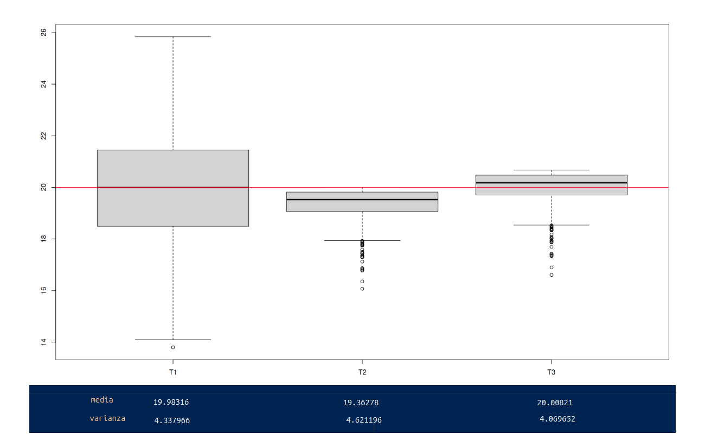

```{r setup, include=FALSE}
knitr::opts_chunk$set(echo = TRUE, message = FALSE, warning = FALSE, comment = NA)
```

<br/><br/>

Los estimadores son variables aleatorias que toman su valor de los datos obtenidos en una muestra y que siguen una distribución conocida (distribuciones muestrales), pero además poseen propiedades deseables como son : insesgadez, eficiencia, consistencia entre otras. Con la figura 2.36 se representa de manera figurativa lo que pueden ser estas propiedades 

<br/>

<center>

```{r, echo=FALSE, out.width="90%", fig.align = "center"}
knitr::include_graphics("img/estimador.png")
```
**Figura 2.36** Caracteristicas de los estimadores (a) baja varianza con sesgo   (b) alta varianza con sesgo  <br/> (c) baja varianza sin sesgo (d) alta varianza sin sesgo.
</center>

En el centro se ubica el parámetro desconocido (punto blanco) y que tratamos de estimar utilizando para ello el estimador apropiado (figurativamente el arma que utilizamos).  En la figura ($a$) tenemos el resultado de un arma (estimador 1) que aunque tiene una alta precisión  ( poca varianza), presenta un desvío del centro  (sesgo). En la figura ($b$) se presenta el resultado de otra arma (estimador 2) que al igual que la primera que presenta un desvío del centro (sesgo), presenta una mayor varianza. La figura ($c$) representa el arma ideal (no tiene sesgo y poca varianza) y por último la figura ($d$)  que en promedio diríamos que está centrada (no sesgo), presenta una variación alta.

Estas caractarísticas ahora en los estimadores se presentan a continuación:

<br/><br/>

<div class="content-box-blue">
## <span style="color:#034a94">**Insesgadez**</span>

<br/>

Un estimador $\widehat{\theta_{3}}$ se considera insesgado si $E[\widehat{\theta_{3}}] = \theta$

Está representado por las figuras 3 y 4 que presentan un comportamiento que en promedio aciertan al centro
</div>

<br/><br/>

<div class="content-box-blue">
## <span style="color:#034a94">**Eficiente**</span>

<br/>

Un estimador  $\widehat{\theta_{1}}$ se considera eficiente, cuando dentro de todos los estimadores insesgados presenta la menor varianza:

$$V[\widehat{\theta_{3}}] < V[\widehat{\theta_{4}}]$$

</div>
<br/><br/>

<div class="content-box-blue">
## <span style="color:#034a94">**Consistente**</span>

<br/>

Cuando un estimador siendo sesgado, se convierte en un estimador sesgado cuando se aumenta el tamaño de la muestra, se dice que este estimador es consistente


$$\lim_{n \to{+}\infty} E[\widehat{\theta}] = \theta$$

</div>
<br/><br/>


### <span style="color:#FF7F00"> **Ejemplo**</span>

<br/>

Para una muestra obtenida de una población exponencial con parámetro $\beta$ ( $E[X]=\beta$, $V[X]=\beta^{2}$). Examinar los siguientes estimadores para una muestra de $n=4$ ($X_{1}$, $X_{2}$, $X_{3}$, $X_{4}$)

+ $\widehat{\theta}_{1} = \dfrac{1}{6}(X_{1}+X_{2}) \dfrac{1}{3}(X_{3}+X_{4})$

<br/>

+ $\widehat{\theta}_{2} = \dfrac{1}{10}(X_{1}+2X_{2} + 3X_{3} + 4X_{4})$

<br/>

+ $\widehat{\theta}_{3} = \dfrac{1}{4}(X_{1} + X_{2} + X_{3} + X_{4})$


<!-- Como se puede verificar  $\widehat{\theta}_{3}$ es el mejor estimador de los tres, siendo insesgado y eficiente -->

<br/><br/><br/><br/>


Primero verifiquemos cuales de los estimadores son insesgados, para ello debemos obtener sus valores esperados:


$$\begin{eqnarray*}
	E\big[\widehat{\theta_{1}}\big] & = & E\Bigg[\dfrac{1}{6}(X_{1}+X_{2}) \dfrac{1}{3}(X_{3}+X_{4})\Bigg] \\
	& = & \dfrac{1}{6}E\bigg[(X_{1}+X_{2})\bigg] \dfrac{1}{3} E\bigg[(X_{3}+X_{4})\bigg]\\
	& = &  \dfrac{1}{6}\bigg[ E\big[X_{1}\big]+E\big[X_{2}\big]\bigg] + \dfrac{1}{3} \bigg[ E\big[(X_{3}\big]+E\big[X_{4}\big]\bigg]\\
	& = & \dfrac{1}{6}\bigg[ \beta+ \beta  \bigg] + \dfrac{1}{3} \bigg[ \beta+ \beta \bigg]\\
	& = & \dfrac{2 \beta}{6} + \dfrac{2 \beta}{3}  = \beta
\end{eqnarray*}$$

Concluimos que $\widehat{\theta_{1}}$ es un estimador insesgado


Se puede verificar que :  

* $\widehat{\theta_{2}}$ es un estimador insesgado

* $\widehat{\theta_{3}}$ también es un estimador insesgado


Para determinar el estimador eficiente se deben encontrar las varianza de los estimadores, para lo cual procedemos de la misma forma:


$$\begin{eqnarray*}
	V\big[\widehat{\theta_{1}}\big] & = & V\Bigg[\dfrac{1}{6}(X_{1}+X_{2}) \dfrac{1}{3}(X_{3}+X_{4})\Bigg] \\
	& = & \dfrac{1}{36}V\bigg[(X_{1}+X_{2})\bigg] + \dfrac{1}{9} V\bigg[(X_{3}+X_{4})\bigg]\\
	& = &  \dfrac{1}{36}\bigg[ V\big[X_{1}\big]+V\big[X_{2}\big]\bigg] + \dfrac{1}{9} \bigg[ V\big[(X_{3}\big]+V\big[X_{4}\big]\bigg]\\
	& = & \dfrac{1}{36}\bigg[ \beta^{2} + \beta^{2}  \bigg] + \dfrac{1}{3} \bigg[ \beta^{2} + \beta^{2} \bigg]\\
	& = & \dfrac{2 \beta^{2}}{36} + \dfrac{2 \beta^{2}}{9}  = \dfrac{10 \beta^{2}}{36}
\end{eqnarray*}$$


Se puede verificar que :  

* $V\big[\widehat{\theta_{2}}\big] =  \dfrac{30 \beta^{2}}{100}$

* $V\big[\widehat{\theta_{3}}\big] =  \dfrac{\beta^{2}}{4}$

Los resultados indican que el estimador insesgado y eficiente es $\widehat{\theta_{3}}$

<br/>

<center>
```{r, echo=FALSE, out.width="100%", fig.align = "center"}

```

<!-- ```{r} -->
<!-- n=50 -->
<!-- m=1000 -->
<!-- x=rexp(n*m,1/4) -->
<!-- m=matrix(x,nrow = m) -->

<!-- T1=1/6*(m[,1]+m[,2])+1/3*(m[,3]+m[,4]) -->
<!-- T2=1/10*(m[,1]+2*m[,2]+3*m[,3]+ 4*m[,4]) -->
<!-- T3=1/4*(m[,1]+m[,2]+m[,3]+m[,4]) -->
<!-- T123 = data.frame(T1,T2,T3)  -->
<!-- boxplot(T123)   -->
<!-- abline(h=4,col="red") -->
<!-- apply(T123,2,mean) -->


<!-- ``` -->

**Figura 2.37** Resultados de simulación de estimadores con distribución exponencial $\lambda = 1/4$
</center>

<br/>

Como se muestra en la figura 2.37 las mejores propiedades las tiene el estimador $\widehat{\theta_{3}}$, posee una valor medio muy proximo a 4 y la menor varianza entre los tres estimadores
