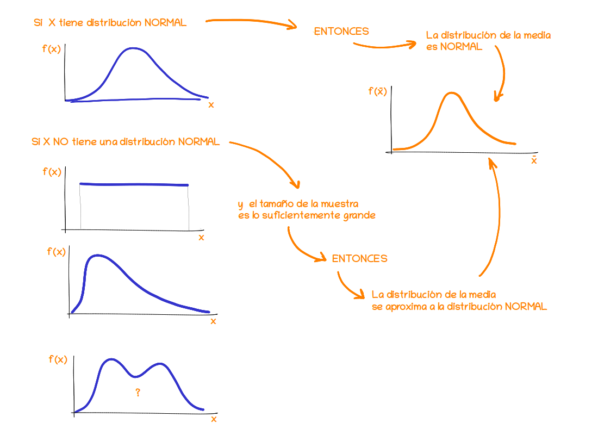
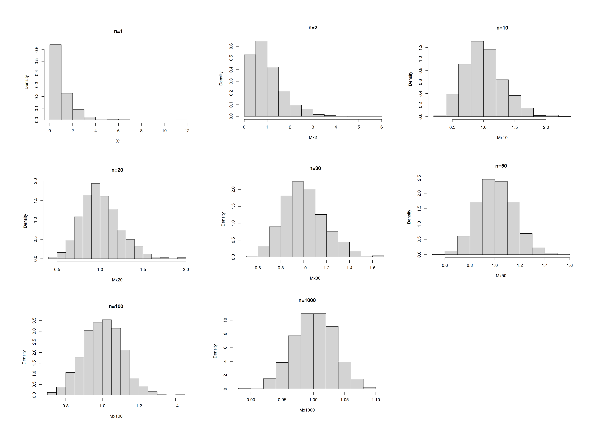
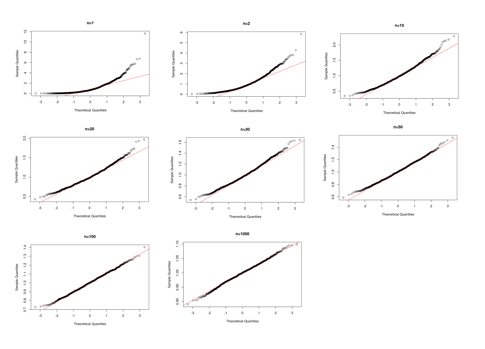

```{r setup, include=FALSE}
knitr::opts_chunk$set(echo = TRUE, message = FALSE, warning = FALSE, comment = NA)
```


<br/><br/>


Si $\bar{X}$ es la media de una muestra de tamaño $n$ tomada una población con media $\mu$ y varianza $\sigma^{2}$, entonces la forma límite de la distribución de  $z =(\bar{X} - \mu)/(\sigma/\sqrt{n})$ se aproxima a una distribución normal estándar.

<br/>

$$Z=\dfrac{\bar{X}-\mu}{\Big(\sigma/\sqrt{n}\Big)} \sim N(0,1) $$

<br/>

Conforme $n\rightarrow \infty$, esta aproximación es cada vez más próxima a la normal. Este teorema es aplicable también a la variable **total** de sumatoria de los valores de la muestra $T_{n}=X_{1}+X_{2}+...+X_{n}$


<br/>

<center>
```{r, echo=FALSE, out.width="100%", fig.align = "center"}

```

**Figura 2.38** Teorema del Límite Central
</center>

<br/>

Como se muestra en la figura 2.38, sin importar la distribución de los datos, la distribución de la media se va transformando en una distribución simétrica, hasta converger en la distgribución normal. Esta aproximación se hace mayor cuanto mas grande sea el tamaño de la muestra  

<br/>

El potencial de este teorema esta en que no importa la distribución de la variable$X$, la distribución de la media proveniente de la muestra tomada de esta población se distribuye aproximadamente normal. 

<br/><br/>

### <span style="color:#FF7F00"> **Ejemplo**</span>

<br/>

Supongamos que se tiene población exponecial con parámetro $\lambda = 1$  con función de densidad de probabilidad dada por :

$$\begin{equation*}
	f(x)=\left\lbrace
	\begin{array}{lll}
		e^{-x}  &,& x > 0   \\
		&&\\
		0 &,& x \leq 0 
	\end{array}
	\right.
\end{equation*}$$


<center>

```{r, echo=FALSE, fig.height=3.5}
#exponencial
library(ggfortify)
ggdistribution(dexp, seq(0, 10, 0.1),rate=1 ,colour = "#FF7F00")
```
<br/>

**Figura 2.39  ** Función exponencial con $\lambda = 1$

</center>

<br/>


y se desea observar el comportamiento de la distribución de medias calculadas a partir de muestras de diferentes tamaños de esta población.  

<br/>

Para verificar el Teorema se realiza el siguiente experimento :

1. Se generan un número grande de valores aleatorio con distribución exponencial con $\lambda=1$, $n \times m$ ($n=1000$, $m=1000$)
2. Se construye una matriz de dimensión  $n \times m$
3. Se generan matrices de dimensión $1000 \times m$, para $m=1$, $2$, $10$, $20$, $30$, $50$, $100$ y $1000$.
4. Para cada matriz generada en el paso (3) se calculan una media por fila, en total 1000 medias
5. Se representan los resultados obtenidos en un diagrama de densidad, histograma y un gráfico de normalidad 

A continuación se presentan tanto el código como los resultados obtenidos


### **Generación de números  y matrices**


```{r, eval=FALSE}
# Teorema Central del Límite-----------------------------
# Paso 1
n=1000   #  numero de columnas (tamaño máximo de muestra)
m=1000*n
# Caso --------------------------------------------------
# distribución exponencial-------------------------------
X=matrix(rexp(m,1),ncol=n)
# Paso 2
# generación de muestras-------------
X1=X[ ,1]            # n=1
X2=X[ ,1:2]          # n=2
X10=X[ ,1:10]        # n=10
X20=X[ ,1:20]        # n=20
X30=X[ ,1:30]        # n=30
X50=X[ ,1:50]        # n=50
X100=X[ ,1:100]      # n=100
# X200=X[ ,1:200]      # n=200
X1000=X[ ,1:1000]    # n=1000
```


<br/><br/>

### **Obtención de las medias para los diferentes tamaños de muestra**

```{r, eval=FALSE}
# Paso 3
# generacion de medias---------------
Mx2=apply(X2,1,mean)        # medias de muestras de tamaño n=2
Mx10=apply(X10,1,mean)      # medias de muestras de tamaño n=10
Mx20=apply(X20,1,mean)      # medias de muestras de tamaño n=20
Mx30=apply(X30,1,mean)      # medias de muestras de tamaño n=30
Mx50=apply(X50,1,mean)      # medias de muestras de tamaño n=50
Mx100=apply(X100,1,mean)    # medias de muestras de tamaño n=100
# Mx200=apply(X200,1,mean)      # medias de muestras de tamaño n=200
Mx1000=apply(X1000,1,mean)  # medias de muestras de tamaño n=1000
```


<br/><br/>

### **Histogramas de medias para diferentes tamaños de muestra**

<br/>

```{r, eval=FALSE}
# par(cex=0.5, cex.axis=.5, cex.lab=.5, cex.main=.5, cex.sub=.5,  mfrow=c(2,2), mai = c(.3, .3, .3, .3))
# histogramas  de comparacion--------------------------
hist(X1,  main = "n=1", freq=FALSE)
hist(Mx2, main ="n=2", freq=FALSE) 
hist(Mx10, main = "n=10",freq=FALSE)
hist(Mx20, main = "n=20",freq=FALSE)
hist(Mx30, main = "n=30",freq=FALSE) 
hist(Mx50, main = "n=50",freq=FALSE) 
hist(Mx100, main = "n=100", freq=FALSE) 
# (Mx200, main = "n=200",freq=FALSE)
hist(Mx1000, main = "n=1000", freq = FALSE)
```


<center>
```{r, echo=FALSE, out.width="100%", fig.align = "center"}

```

**Figura 2.40** Comparación distribuciones medias muestrales para $n = 1$, $2$, $10$, $20$, $30$, $50$, $100$ y $1000$
</center>

<br/><br>

Se puede observar que a medida que aumenta el tamaño de muestra $n$, la forma del histograma se vuelve simétrico, indicando su  transformación a comportamiento normal

<br/>


### **Gráficos de normalidad para las medias en diferentes tamaños de muestra**

<br/>


```{r, eval=FALSE}
# bpar(cex=0.5, cex.axis=.5, cex.lab=.5, cex.main=.5, cex.sub=.5,  mfrow=c(2,2), mai = c(.3, .3, .3, .3))
# histogramas  de comparacion--------------------------
qqnorm(X1, main="n=1") ; qqline(X1, col="red")
qqnorm(Mx2, main = "n=2") ; qqline(Mx2, col="red")
qqnorm(Mx10, main ="n=10") ; qqline(Mx10, col="red")
qqnorm(Mx20, main ="n=20") ; qqline(Mx20, col="red")
qqnorm(Mx30, main = "n=30") ; qqline(Mx30, col="red")
qqnorm(Mx50, main = "n=50") ; qqline(Mx50, col="red")
qqnorm(Mx100, main ="n=100") ; qqline(Mx100, col="red")
# qqnorm(Mx200) ; qqline(Mx200, col="red")
qqnorm(Mx1000, main="n=1000") ; qqline(Mx1000, col="red")
```

<br/><br/>

<center>
```{r, echo=FALSE, out.width="100%", fig.align = "center"}

```

**Figura 2.41** Comparación graficos de normalidas de la media nuestral para $n = 1$, $2$, $10$, $20$, $30$, $50$, $100$ y $1000$

</center>


Los resultados muestras desde un gráfico de valores no normales hasta un gráfico de puntos completamente aliniados con la recta diagonal que representa la conincidencia entre los percentiles teóricos normales con los percentiles muestrales, indicando así una convergencia a la distribución normal.


