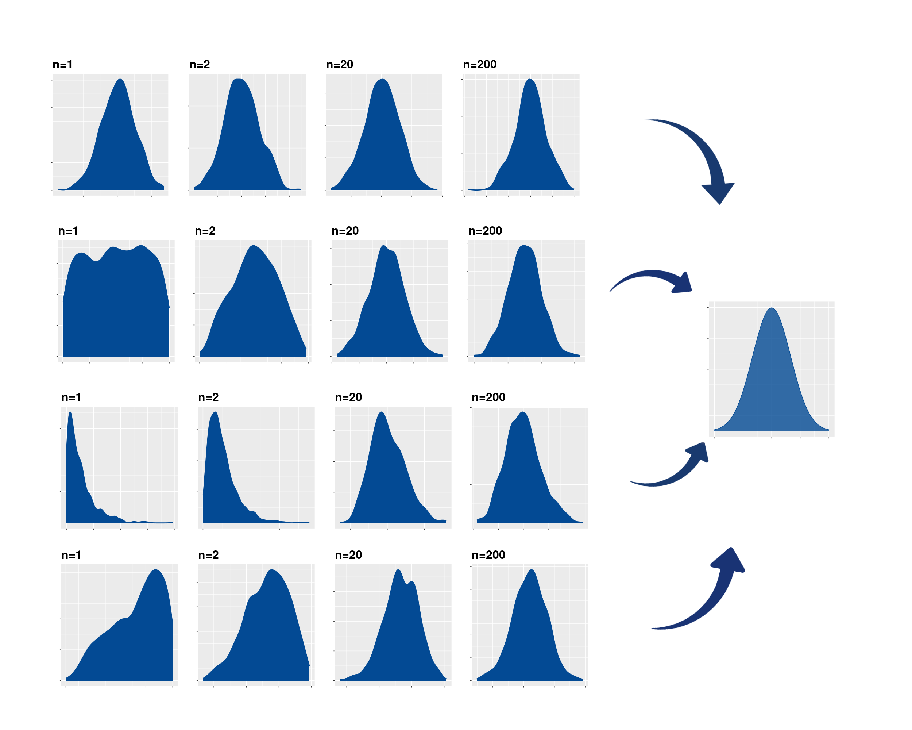

<br/><br/>

## **Teorema central del límite**: 

<br/>

Si $\bar{X}$ es la media de una muestra de tamaño $n$ tomada una población con media $\mu$ y varianza $\sigma^{2}$, entonces la forma límite de la distribución de  $z =(\bar{X} - \mu)/(\sigma/\sqrt{n})$ se aproxima a una distribución normal estandar.


$$Z=\dfrac{\bar{X}-\mu}{\Big(\sigma/\sqrt{n}\Big)} \sim N(0,1) $$

Conforme $n\rightarrow \infty$, esta aproximación es cada vez más próxima a la normal. Este teorema es aplicable tambien a la variable **total** de sumatoria de los valores de la muestra $T_{n}=X_{1}+X_{2}+...+X_{n}$


```{r, echo=FALSE, out.width="100%", fig.align = "center"}

```

Como se muestra en las gráficas, sin importar la distribución de los datos (n=1), la distribución de la media se va transformando en una distribución simetrica, hasta convertirse en una normal  


El potencial de este teorema esta en que no importa la distribución de la variable X, la distribución de la media provemiente de la muestra tomada de esta población se distribuye aproximadamente normal. 

<br/><br/>
