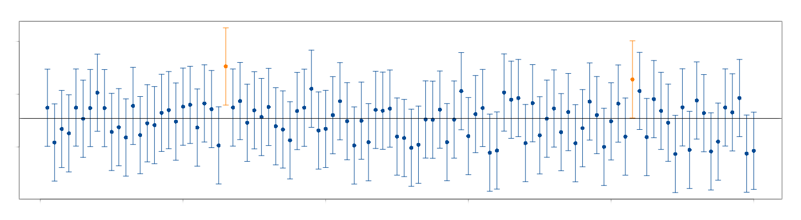

```{r setup, include=FALSE}
knitr::opts_chunk$set(echo = TRUE, message = FALSE, warning = FALSE, comment = NA)
# library(paqueteMETODOS)

```

<br/><br/>

<!-- ```{r, echo=FALSE, out.width="100%", fig.align = "center"} -->
<!--  -->
<!-- ``` -->
<!-- Tomada de : pixabay.com -->

<br/>

Un estimador por intervalo de confianza (IC) es una regla que especifica como usar las mediciones obtenidas en una muestra para calcular dos números que forman los extremos del intervalo que confiamos contenga al parámetro de interés $\theta$. Dependiendo del parámetro se utiliza en la construcción del IC las distribuciones muestrales:  `normal estándar` , `t-Student`, `chi-cuadrado` o `F-Fisher`

<br/>

<center>
**Tabla 2.8** Intervalos de confianza para parámetros de una población
</center>

|**parámetro** |**Estimador por IC **                                                            | **Supuestos** |
|:------------:|:-------------------------------------------------------------------------------:|:---------------------:|
| $\mu$         |$\bar{x} \pm z_{\alpha/2} \hspace{.1cm}\dfrac{\sigma}{\sqrt{n}}$                 |$X\sim N(\mu, \sigma^{2})$,$\sigma^{2}$ conocida           |
|               |$\bar{x} \pm z_{\alpha/2} \hspace{.1cm}\dfrac{s}{\sqrt{n}}$                      |$n>>$, TCL|
|              |$\bar{x} \pm t_{\frac{\alpha}{2};v=n-1} \hspace{.1cm}\dfrac{s}{\sqrt{n}}$        |$X\sim N(\mu, \sigma^{2})$, $\sigma^{2}$ desconocida|
|$p$           |$\widehat{p}\pm z_{\frac{\alpha}{2}} \sqrt{\frac{\widehat{p}(1-\widehat{p})}{n}}$| $n>>$|
|$\sigma^{2}$  |$\Bigg( \dfrac{(n-1)s^{2}}{\chi^{2}_{1-\alpha/2}} ;\dfrac{(n-1)s^{2}}{\chi^{2}_{\alpha/2}} \Bigg)$ | $X\sim N(\mu, \sigma^{2})$|

<br/><br/><br/>

## <span style="color:#034a94">**Conceptos básicos**</span>


<br/><br/>

## <span style="color:#034a94">**Confianza**</span>

Para explicar el concepto de confianza se simula 100 intervalos para la estimación de una media con valor de $\mu=100$, como se ve en la gráfica no todos los intervalos (representados por una línea) contienen el valor del parámetro, solo de color negro lo contiene.

Al contarlos se encuentra que 2 no lo contienen (de color naranja), mientras que  98 lo contiene, por tanto este procedimiento tiene una confianza del 98% de contener el valor de $\mu$.


<center>
```{r, echo=FALSE, out.width="100%", fig.align = "center"}

```

**Figura 2.42** Representación de la confianza mediante la simulación de intervalos
</center>


Este valor se integra al concepto de intervalo de confianza mediante el término $1-\alpha$, por defecto los programas utilizan un nivel de confianza del 95% ( $1-\alpha =0.95$) y se de nota por : $IC_{\mu; 1-\alpha=0.95}$ 

<br/><br/><br/>

## <span style="color:#034a94">**Grados de libertad**</span>

Una definicion de grados de libertad encontrada: [¿Qué son los llamados “grados de libertad”?](https://psicologiaexperimental.files.wordpress.com/2010/04/grados-de-libertad.pdf) escrito por : Roberto Behar y Pere Grima, los define como el número de dimensiones en los que se puede mover un valor por asignar. En el caso de una variable X, solo tenemos un grado de libertad para asignar este valor. En el caso de tener una variable bidimensional (X,Y), al momento de asignar valores a esta variable tenemos dos dimensiones = dos grados de libertad. Sin embargo que colocamos la restricción de que X+Y=10, perdemos un grado de libertad, dado que al colocar el primero, el segundo queda asignado por la restricción.

En el caso de una muestra de tamaño $n$ que se puede representar como ($X_{1}$,$X_{2}$,$X_{3}$,$X_{4}$,$X_{5}$ \docs, $X_{n}$), lo cual está asociado con un espacio de $n$ dimensiones. En el caso de conocer el valor de $\bar{X}$, los grados de libertad se reducen a $n-1$

Como ejemplo supongamos que tenemos una muestras de datos formado por : $X_{1}$,$X_{2}$,$X_{3}$,$X_{4}$,$X_{5}$. Con media $\mu$. En este caso tendremos $n-1$ grados de libertad dado que conocemos el valor de la media en este caso. Es decir que tendríamos libertad de asignar 4 de los valores de la muestra, dado que el último estaría determinado por el valor de la media.

<br/><br/><br/><br/>


## <span style="color:#034a94">**Para una población**</span>


Para una población puede ser de interés estimar el intervalo de confianza para su media ($\mu$), para una proporción ($p$) o una varianza ($\sigma^{2}$)


<br/>

## <span style="color:#034a94">**Para la media, con varianza conocida**</span> 

Partimos de dos valores que contiene el parámetro $\theta$

$$L_{I} \leq \theta \leq L_{S} $$

bajo el supuesto de que Z sigue una distribución normal estándar

$$Z=\frac{\bar{X}-\mu}{\sigma/\sqrt{n}} \sim N(0,1)$$

podemos construir el siguiente intervalo

$$P(L_{IC} \leq Z \leq L_{SC})=1-\alpha $$

donde $(1-\alpha)$ conforma el concepto de confianza, el cual difiere del concepto de probabilidad, en cuanto la confianza representa la proporción de intervalos que contienen el parámetro. Lo que significa que de 100 intervalos construidos a partir muestras aleatorias, $(1-\alpha)$% o más contendrán el parámetro. 

$$\begin{eqnarray*}
	P(-z_{\alpha/2} \leq Z \leq z_{\alpha/2})&=&1-\alpha \\
	P\Bigg(-z_{\alpha/2} \leq \frac{\bar{X}-\mu}{\sigma/\sqrt{n}} \leq z_{\alpha/2}\Bigg)&=&1-\alpha\\
	P\Bigg(\bar{X}-z_{\alpha/2}\frac{\sigma}{\sqrt{n}} \leq \mu \leq \bar{X}+z_{\alpha/2}\frac{\sigma}{\sqrt{n}}\Bigg)&=&1-\alpha \\
\end{eqnarray*}$$

el intervalo de confianza para la media poblacional queda determinado por:

<div class="content-box-blue">

$$IC_{\mu}: \bar{x} \pm z_{\alpha/2} \hspace{.1cm}\dfrac{\sigma}{\sqrt{n}}$$

Supuestos:

* $X\sim N(\mu,\sigma^{2})$
*	varianza conocida

</div>

<br/><br/><br/>

## <span style="color:#034a94">**Para la media, con varianza desconocida**</span>

En este caso se utiliza la distribución t-Student que presenta como parámetro n-1 grados de libertad


$$T=\dfrac{\bar{X}-\mu}{s/ \sqrt{n}}$$


$$\begin{eqnarray*}
	P\Big(-t_{\alpha/2} \leq T \leq t_{\alpha/2} \Big)&=&1-\alpha \\
	P\Big(-t_{\alpha/2} \leq \frac{\bar{X}-\mu}{s/\sqrt{n}} \leq t_{\alpha/2} \Big)&=&1-\alpha \\
	P\Bigg(\bar{X}-t_{\alpha/2} \dfrac{s}{\sqrt{n}} \leq \mu \leq \bar{X}+t_{\alpha/2}\dfrac{s}{\sqrt{n}}\Bigg)&=&1-\alpha \\
\end{eqnarray*}$$

<div class="content-box-blue">

$$IC_{\mu}: \bar{x} \pm t_{\alpha/2} \hspace{.1cm}\frac{s}{\sqrt{n}} $$

Supuestos:

*	$X\sim N(\mu,\sigma^{2})$
* varianza desconocida

</div>

<br/><br/>

Cuando el tamaño de la muestra se considera grande (usualmente $n>30$) el estadístico T se aproxima a la distribución normal estándar, en este caso el intervalo de confianza se puede construir a a partir de:

<div class="content-box-blue">

$$IC_{\mu}: \bar{x} \pm z_{\alpha/2} \hspace{.1cm}\dfrac{s}{\sqrt{n}} $$

Supuestos:

* $X\sim N(\mu,\sigma^{2})$
* varianza desconocida

</div>

<br/><br/><br/>

### <span style="color:#FF7F00"> **Ejemplo**</span>

Se registró el tiempo transcurrido entre la facturación y la recepción del pago, para una muestra de 100 clientes en una empresa. La media y la desviación estándar son respectivamente: 39.1 días y 17.3 días. Con el fin de establecer una medición de la calidad en el servicio, se requiere determinar una estimación del 95% para la media.

Este caso también se utiliza cuando se desconoce la distribución de la variable X. En este caso se utiliza el teorema central del límite que aproxima la distribución de la media muestral a la distribución normal

<br/><br/>

### <span style="color:#686868">**Solución**</span> 

La estimación del tiempo que demora el pago de una factura es un valor de importancia tanto para empresarios como para proveedores, pues esta información se utiliza para la programación de gastos e ingresos. El problema nos suministra la siguiente información:

* $\bar{x}=39.1$ días
* $s=17.3$ días, lo que significa que se desconoce la varianza
* $n=100$ que se considera grande
* se requiere construir un IC del 95\% para $\mu$, que implica un valor del percentil $z=\pm 1.96$

$$\bar{x} \pm z_{\alpha/2} \frac{s}{\sqrt{n}} $$

$$39.1 \pm 1.96 \frac{17.3}{\sqrt{100}} $$

$$\Bigg(39.1 -1.96 \frac{17.3}{\sqrt{100}};39.1 + 1.96 \frac{17.3}{\sqrt{100}}\Bigg)$$

$$(35.71; 42.49 )$$

El tiempo promedio transcurrido entre la facturación y el pago en la empresa está entre 35.7 días y 42.5 días con una confianza del 95% 

<br/><br/><br/>

## <span style="color:#034a94">**Tamaño de la muestra para estimar una media**</span>

Uno de los problemas más frecuentes a los que nos enfrentamos es la determinación del tamaño de la muestra para realizar una estimación de la media que garantice una confianza del $(1-\alpha)\%$

$$P\Bigg(-z_{\alpha/2}\frac{\sigma}{\sqrt{n}} \leq \bar{X}-\mu \leq z_{\alpha/2}\frac{\sigma}{\sqrt{n}}\Bigg)=1-\alpha$$

Para construirlo partimos del supuesto que podemos tolerar un error de muestreo
$$e = \vert\bar{x}-\mu\vert \leq z_{\alpha/2}\frac{\sigma}{\sqrt{n}}$$

y que deseamos una con fiabilidad del $(1-\alpha)\%$.

Entonce podemos tener la confianza del $(1-\alpha)\%$ de que el error no exceda $z_{\alpha/2} \frac{\sigma}{\sqrt{n}}$ 	de la siguiente igualdad despejamos $n$

$$e= z_{\alpha/2} \frac{\sigma}{\sqrt{n}}$$

$$e^{2}= z_{\alpha/2}^{2} \frac{\sigma^{2}}{n}$$
<div class="content-box-blue">

$$n = \displaystyle\frac{z_{\alpha/2}^{2}\sigma^{2}}{e^{2}}$$
</div>

<br/><br/>

### <span style="color:#FF7F00"> **Ejemplo**</span>

Se desea estimar la media de las personas que han fallecido por Covid19 en Colombia, con una confianza del 98% y un error de muestreo de 1 persona . ¿Qué tamaño deberá tener la muestra para cumplir con estas condiciones?

<br/><br/>

### <span style="color:#686868">**Solución**</span>

Información:

Confianza  : 98%  ($z_{\alpha/2}$)

error de muestro : 3 una personas ($|\bar{x}-\mu| < e$)

varianza : no tenemos la varianza y por tanto tenemos 3 alternativas :

1. mediante un estudio previo similar obtener el valor de la varianza,  
2. realizar una muestra piloto  que puede ser de n=40 y con ella estimar la varianza $s^{2}$, 
3. preguntando a un experto sobre el valor del mínimo y el máximo de la variable se puede estimar la desviación estándar 
$s=\frac{\max\{x\}-\min\{x\}}{4}$   

```{r}
# varianza
# s2.nota=var(sample(Colombia$edad, 100))
s2.nota = 352.2395
# confianza : 1-a
a = 1 - 0.98
# error de nuestre
e = 3 # personas 

# tamaño de muestra utilizando función sizemu de paqueteMET
# n=paqueteMETODOS::sizemu(qnorm(1-a/2),s2.nota,e)
# round(n,0)  # redondeo a entero


```

<br/><br/>

## <span style="color:#034a94">**Para la proporción**</span> 

La construcción del intervalo de confianza para una proporción es similar al proceso realizado en la construcción de la media, bajo el supuesto de $np>10$ que permite la aproximación a una distribución normal

$$\widehat{p} \sim N\Bigg(p, \frac{p(1-p)}{n}\Bigg)$$

por tanto

$$\Bigg[ \hspace{.3cm}\widehat{p}+z_{\alpha/2}\sqrt{\frac{\widehat{p}\hspace{.1cm}(1-\widehat{p}}{n}} \hspace{.2cm};\hspace{.2cm} \widehat{p}+z_{\alpha/2}\sqrt{\frac{\widehat{p}\hspace{.1cm}(1-\widehat{p}}{n}} \hspace{.3cm} \Bigg] $$

<div class="content-box-blue">

$$IC_{p}: \widehat{p} \pm z_{\alpha/2} \hspace{.1cm}\sqrt{\frac{\widehat{p}(1-\widehat{p})}{n}}$$

Supuesto:

* $np>5$ o $n(1-p)>5$

</div>

<br/><br/><br/>	


### <span style="color:#FF7F00"> **Ejemplo**</span>

En una encuesta aleatoria realizada a 500 familias de la ciudad que poseen televisión por cable,  se encuentra que 340 tienen suscripción a HBO.  Calcule un intervalo de confianza para la proporción de familias que tienen suscripción a HBO en la ciudad. Interprete el resultado obtenido.

<br/><br/>

### <span style="color:#034a94">**Solución**</span> 

```{r}
prop.test(340,500)$conf.int
```


De acuerdo con el resultado anterior, se puede afirmar con una confianza del 95% que entre el 63.7% y el 72.0% de las familias tienen una suscripción a HBO


<br/><br/><br/>


## <span style="color:#034a94">**Tamaño de muestra para la estimación de una proporción**</span>

<div class="content-box-blue">

$$n=\dfrac{z_{\alpha/2}^{2}\hspace{.3cm} p(1-p)}{e^{2}}$$
Donde :

+ $z_{\alpha/2}$ : representa el percentil de la distribución normal relacionado con la confianza

+ $p$ : la proporción y p(1-p) la varianza.  Para conocerla se puede hacer uso de una estimación a través de una prueba piloto, la varianza máxima que ocurre cuando $p=0.5$  ($pq=0.25$)

+ $e$ : el error de muestreo que representa la tolerancia al erro que tiene el investigador ($|\widehat{p}-p|<e$).

</div>

<br/><br/><br/>

### <span style="color:#FF7F00"> **Ejemplo**</span>

Una empresa requiere realizar un estudio para establecer las proporción de fallas diarias que presta la empresa al presentar un servicio . El gerente encargado del estudio decide que la tasa de error máximo tolerable debe ser del 5% y el nivel de confianza del 99% . Con esta información una firma de consultora presenta una propuesta a la empresa por valor de \$ 110.2 millones para realizar el estudio y justifica su costo así: Por costos administrativos y de logística corresponde un valor de \$ 55.4 millones y cada encuesta realizada tiene un valor de $50 mil pesos. El Director de la empresa le encarga a usted revisar la información darle un concepto sobre la propuesta realizada por la firma de auditores a la mayor brevedad

<br/><br/>

### <span style="color:#686868">**Solución**</span>

Información de la solicitud: 

* Objetivo : Analizar la propuesta realizada por la firma externa
+ Valor total : 110.2 millones
+ Valor costos administrativos y logísticos : 25.4 millones
+ Valor encuestas : 110.2-55.4 = 54.8 millones
+ Número de encuestas propuestas a realizar : 1096
+ nivel de confianza 99%
+ error de muestreo 0.05

```{r}
# library(paqueteMETODOS)
#paqueteMETODOS::sizep(qnorm(0.995),0.5,0.05)
```

De acuerdo con la información sumunistrada por la empresa, el tamaño de muestra apropiado para la estimación de la proporción, suponiendo varianza máxima es de $n=664$, por tal razón la propuesta realiza por la empresa consultora excede en   432 encuesta que presentan un sobre costo de \$21.6 millones

<br/><br/><br/>

## <span style="color:#034a94">**Para una varianza**</span> 

En el caso del intervalo de confianza para la varianza se parte de la premisa de que la variable $ X^{2}$ sigue una distribución chi-cuadrado con $(n-a)$ grados de libertad

$$\frac{(n-1)S^{2}}{\sigma^{2}} \sim \chi^{2}_{v=n-1}$$

a partir de ella se puede construir

$$P\Bigg(\chi^{2}_{1-\alpha/2} \leq \frac{(n-1)S^{2}}{\sigma^{2}} \leq \chi^{2}_{\alpha/2} \Bigg)=1-\alpha$$

al invertir esta ecuaciones tenemos

$$P\Bigg(\frac{1}{\chi^{2}_{1-\alpha/2}} \geq \frac{\sigma^{2}}{(n-1)S^{2}} \geq \frac{1}{\chi^{2}_{\alpha/2}} \Bigg)=1-\alpha$$

finalmente tenemos

$$P\Bigg( \frac{(n-1)S^{2}}{\chi^{2}_{\alpha/2}} \leq \sigma^{2} \leq \frac{(n-1)S^{2}}{\chi^{2}_{1-\alpha/2}} \Bigg)=1-\alpha$$

<div class="content-box-blue">


$$IC_{\sigma^{2}}: \Bigg( \displaystyle\frac{(n-1)S^{2}}{\chi^{2}_{1-\alpha/2 ; v=n-1}} ;\displaystyle\frac{(n-1)S^{2}}{\chi^{2}_{\alpha/2; v=n-1}} \Bigg)$$

Supuestos:

* $X\sim N(\mu,\sigma^{2})$

</div>

<br/><br/><br/>

 <span style="color:#FF7F00"> **Ejemplo**</span>

Se quiere estimar un intervalo de confianza del 95% para la desviación estandar de los precios de los últimos 22 dias (sep.10.2021 a oct.7.2021, tomados de :Investing.com)

<br/><br/>

```{r}
# install.packages("paqueteMETODOS")
# library(paqueteMETODOS)
ecopetrol=c(2810, 2810,	2825, 2769, 2734, 2706,	2699, 2671, 2550, 2590,	2570, 2529,	2520, 2566,	2615, 2620, 2550, 2572,	2553, 2570,	2593, 2606)	

# cat("IC_var : ", paqueteMETODOS::intervalo.var(ecopetrol),"\n")  # intervalo de confianza para la varianza
# cat("IC_sd  : ",sqrt(paqueteMETODOS::intervalo.var(ecopetrol)))# intervalo de confianza para la desviación estándar
```
<br/><br/>

Se estima con una confianza del 95% que la desviación estándar del precio de las acciones de Ecopetrol está entre \$ 75.7 y \$ 140.0 

<br/><br/><br/>
