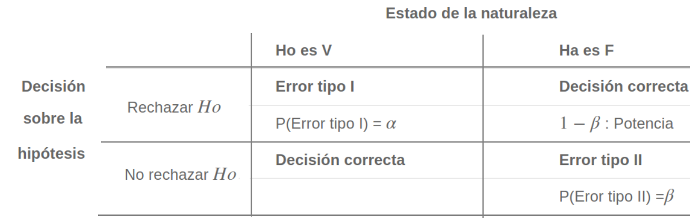

```{r setup, include=FALSE}
knitr::opts_chunk$set(echo = TRUE, message = FALSE, warning = FALSE, comment = NA)

# install.packages('gtools')
# install.packages("TeachingSampling")

#load library
library(gtools)
library(TeachingSampling)
library(readr)
library(paqueteMET)

c1="#FF7F00"
c2="#034A94"
c3="#0EB0C6"
c4="#686868"

data("CarreraLuz22")
data("evaluacion")

```

<br/><br/>


<center>
```{r, echo=FALSE, out.width="100%", fig.align = "center"}
knitr::include_graphics("img/prueba.png")
```

**Figura 4.44**  Prueba clínica
</center>

<br/><br/>


## <span style="color:#034a94">**Introducción**</span>

Actualmente se realizan pruebas de sangre para determinar su una persona padece de una enfermedad o no, supongamos Covid-19. Para realizar la prueba se toma una muestra de sangre del paciente con la que se realiza un protocolo, después del cual se concluye o no que el paciente examinado tienen o no el virus. De igual manera la Estadística proporciona los elementos que permiten a partir de los datos recogidos en una muestra establecer el valor de verdad de una afirmación sobre un parámetro poblacional (hipótesis). 

Este procedimiento tiene sus orígenes al  alrededor de 1738, cuando en un ensayo escrito por Daniel Bernoulli(1) aparece el cálculo una estadística de prueba para ensayar su hipótesis en el campo de la astronomía. Entre 1915 y 1933 se desarrolla esta formulación gracias a los estudios realizados por tres grandes autores: Ronald Fisher(2), Jerzy Neyman(3) y Egon Pearson(4). Hoy en día predomina la teoría de Neyman-Pearson (lema de Neyman-Pearson).

```{r, echo=FALSE, out.width="50%", fig.align = "center"}
# knitr::include_graphics("img/prueba.jpg")
```


Una hipótesis estadística es una afirmación o conjetura acerca de los parámetros de la distribución de probabilidades de una población. Si la hipótesis estadística especifica completamente la distribución, entonces ella se llama **Hipótesis Simple**, de otra manera se llama Hipótesis Compuesta. 

Desde el punto de vista clásico, todas las pruebas de hipótesis trabajan en base a ciertos principios que consideran:

+ Hipótesis nula (**Ho**)
+ Hipótesis alterna (**Ha**)
+ Estadístico de Prueba (**EdeP**)
+ Región de Rechazo (**RdeR**)
+ Regla de Decisión(**RD**)

<br/><br/>

## <span style="color:#034a94">**Conceptos básicos**</span> 

<br/>

## <span style="color:#034a94">**Hipótesis nula (Ho)**</span> 

Es la hipótesis a probar, ésta NO se rechaza si de la muestra no se obtiene suficiente evidencia para rechazarla.

<br/><br/>

## <span style="color:#034a94">**Hipótesis alterna (Ha)**</span> 

La hipótesis $Ho$ se contrasta con la hipótesis Ha, y ésta última corresponde a valores alternativos del parámetro planteados en la hipótesis nula. La hipótesis $Ha$ se considera cierta si existe suficiente evidencia para rechazar la hipótesis nula.

<br/><br/>

## <span style="color:#034a94">**Estadístico de prueba  (EdeP)**</span>  

Es una función de la muestra que contiene información sobre el parámetro de interés, la que nos permite decidir sobre el rechazo de la hipótesis nula, $H_o$ . Es también una variable aleatoria que sigue una función de distribución conocida como por ejemplo:

Para una muestra determinada se obtiene un valor del estadístico de prueba, a partir del cálculo y se determina el rechazo o no, de la hipótesis nula.

<br/><br/>

## <span style="color:#034a94">**Región de rechazo (RdeR)**</span>  

También llamada región crítica (RC), define los valores del estadístico de prueba para los cuales la información muestral contradice la hipótesis nula. Estos valores nos permitirán adoptar una regla de decisión consistente. Una prueba de una hipótesis estadística es un procedimiento que permite, mediante el contraste entre la información muestral y lo propuesto en una hipótesis, decidir sobre
su rechazo. 

Una prueba de una hipótesis estadística es un procedimiento que permite, mediante el contraste entre la información muestral y lo propuesto en una hipótesis, decidir sobre
su rechazo. 

<br/><br/>

## <span style="color:#034a94">**Regla de Decisión (RdeD)**</span>  

De esta manera, como una regla de decisión, si para una muestra particular el estadístico de prueba (valor calculado) cae dentro de la región crítica, rechazaremos la hipótesis nula $H_{o}$ en favor de la hipótesis alternativa $H_{a}$. En cambio, si el valor calculado no cae dentro de la RC, no podremos rechazar la hipótesis nula y por tanto decimos que la información contenida en la muestra no ofrece suficiente evidencia estadística que nos permita rechazar $H_o$, ASUMIMOS que la hipótesis nula es cierta. 

<br/><br/>

## <span style="color:#034a94">**Errores asociados**</span>

Cuando se decide ya sea en favor o en contra de una determinada prueba de hipótesis, es posible estar en una de las cuatro situaciones descritas en la siguiente tabla:

<center>
**Tabla 2.8** Tipos de errores presentes en una prueba de hipótesis
</center>

```{r, echo=FALSE, out.width="80%", fig.align = "center"}

```
<!-- |                   |  **Estado de la naturaleza**    |                                 | -->
<!-- |:------------------|:--------------------------------|:--------------------------------| -->
<!-- |                   |      **Ho es V**                |  **Ha es F**                    | -->
<!-- | **Decisión sobre la hipótesis**|                    |                                 | -->
<!-- |Rechazar $Ho$      | **Error tipo I**                | **Decisión correcta**           | -->
<!-- |                   | P(Error tipo I) = $\alpha$      | $1-\beta$ : Potencia            | -->
<!-- |No rechazar $Ho$   | **Decisión correcta**           | **Error tipo II**               | -->
<!-- |                   |                                 | P(Eror tipo II) =$\beta$        | -->
<!-- |                   |                                 |                                 | -->

Existen dos situaciones en las que se comenten errores después de tomar una decisión:

<br/><br/>

### <span style="color:#034a94">**Error tipo I**</span>

Cuando se rechazamos una hipótesis nula que en realidad es verdadera. Tomando como símil la situación donde un médico desea determinar si un paciente está sano o enfermo ($H_o$: SANO vs $H_a$: ENFERMO), es posible que concluya que el paciente está enfermo (rechace $H_o$) cuando en verdad esta persona esta sana. En términos de probabilidad este error se debe de representar como:

<div class="content-box-blue">
$$P(\text{Rechazar } H_o | H_o \text{ es verdadera})= \alpha$$
</div>

### <span style="color:#FF7F00"> **Ejemplo**</span>

Para ilustrar el error tipo I, podemos acudir aun evento ocurrido a una estudiante que después de realizar una donación de sangre fue requerida por la clínica benefactora, pues el examen que le habían practicado a la sangre donada, presentaba signos de estar infectada por hepatitis c. Esto prendió las alarmas en la casa y fue llevada por la familia a que se le realizaran otros exámenes para confirmar el diagnostico inicial. Las segundas pruebas evidenciaron que se trataba de un error. Este caso constituye un caso de falso positivo (Se diagnostica como enferma, cuando en verdad esta sana) 


<br/><br/>

### <span style="color:#034a94">**Error Tipo II**</span> 

Cuando no se rechaza una hipótesis nula que en realidad es falsa. Utilizando el ejemplo del médico, diríamos que cuando el medico indica que el paciente esta sano, cuando esta realmente enfermo, incurre en un error frecuente cuando algunos pacientes son asintomáticos y aunque tienen la enfermedad, sus exámenes médicos salen negativos. En este caso la probabilidad se representa como:

<div class="content-box-blue">
$$P(\text{No rechazar } H_o | H_o \text{ es falsa}) $$
</div>

### <span style="color:#FF7F00"> **Ejemplo**</span>

Para ilustrar el caso del error tipo II, recurrimos a lo acontecido en el Tour de Francia, donde el ciclista estadounidense Lance Armstrong gano esta competencia seis veces de manera consecutiva y aunque fue acusado de dopin, no se le pudo comprobar. Fue solo en el 2012 cuando el mismo admitió haber usado EPO. Podemos decir que durante su vida deportiva los exámenes practicados dieron negativos, estando el dopado. Este caso se cataloga como falso negativo. 

<br/><br/>

## <span style="color:#034a94">**Nivel de significancia ($\alpha$)**</span>  

No es posible minimizar simultáneamente, las probabilidades de los errores tipo I y II, ya que en la medida que uno disminuye el otro aumenta, como se muestra en la figura siguiente, en la que claramente se ve que la reducción del área $\alpha$ (probabilidad de error tipo I), implica el aumento del área $\beta$ (probabilidad de error tipo II).

<br/><br/>

<div class="content-box-blue">
## <span style="color:#034a94">**Tipos de pruebas de hipótesis**</span>

|                   |                                                                 |
|:------------------|:----------------------------------------------------------------|
|Dos colas          |$H_{o}: \theta = \theta_{o}$ vs $H_{a}: \theta \neq \theta_{o}$  |
|Cola superior      |$H_{o}: \theta \leq \theta_{o}$ vs $H_{a}: \theta > \theta_{o}$  |
|Cola inferior      |$H_{o}: \theta \geq \theta_{o}$ vs $H_{a}: \theta < \theta_{o}$  |

</div>
<br/><br/>